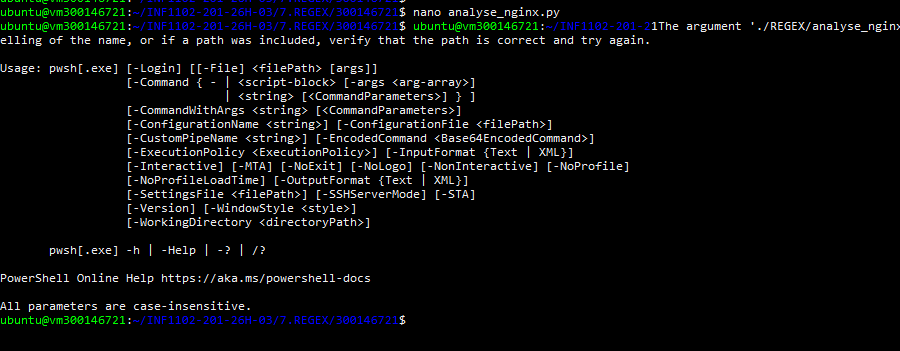
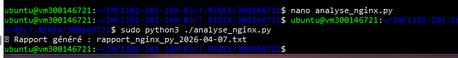
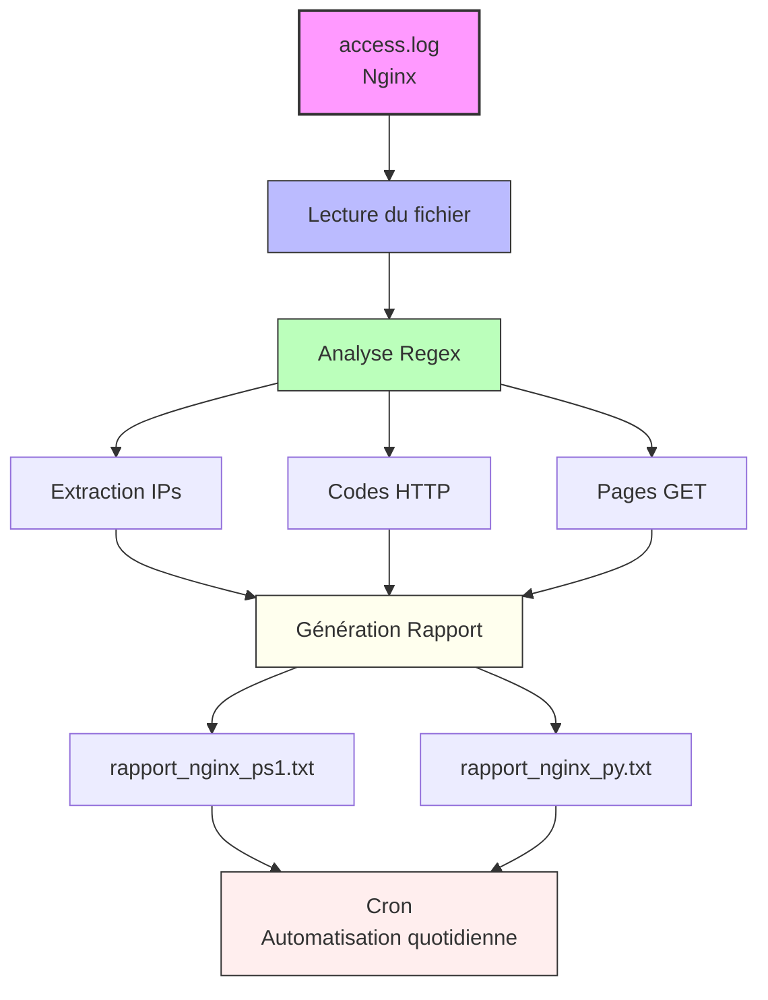

$# 📝 REGEX — Laboratoire Analyse des logs Nginx

> **Étudiant :** 300146721  
> **Cours :** INF1102-201-26H-03  
> **Environnement :** Ubuntu 22.04 (Jammy) — PowerShell (pwsh) & Python 3  
> **Durée estimée :** 90 à 120 minutes

---

## 🎯 Objectifs du laboratoire

À la fin de ce laboratoire, l'étudiant est capable de :

1. Comprendre et utiliser les **expressions régulières (Regex)**
2. Analyser un fichier de log **Nginx** avec PowerShell et Python
3. Extraire des informations clés : **IPs, codes HTTP, pages visitées**
4. Générer un **rapport texte automatique**
5. Automatiser l'exécution via **cron**
6. Comparer l'utilisation des Regex en **Bash, PowerShell et Python**

---

## 📁 Structure du projet

```plaintext
REGEX/
├── analyse_nginx.ps1                        # Script PowerShell d'analyse
├── analyse_nginx.py                         # Script Python d'analyse
├── rapport_nginx_ps1_YYYY-MM-DD.txt         # Rapport généré par PowerShell
└── rapport_nginx_py_YYYY-MM-DD.txt          # Rapport généré par Python
```

---

## 🧩 Rappel — Symboles Regex essentiels

| Symbole   | Signification            | Exemple            |
|-----------|--------------------------|--------------------|
| `.`       | N'importe quel caractère | `a.c` → abc, a1c   |
| `\d`      | Chiffre (0–9)            | `\d{3}` → 123      |
| `\w`      | Lettre ou chiffre        | `\w+` → abc123     |
| `^`       | Début de ligne           | `^Hello`           |
| `$`       | Fin de ligne             | `end$`             |
| `+`       | 1 ou plusieurs           | `ab+c` → abc       |
| `*`       | 0 ou plusieurs           | `ab*c` → ac, abc   |
| `()`      | Groupe / capture         | `(ab)+` → abab     |
| `[^]`     | Négation                 | `[^0-9]` → lettre  |

---

## 🔹 PARTIE 1 — Création du script PowerShell

Création et édition du fichier `analyse_nginx.ps1` :

```bash
nano analyse_nginx.ps1
```

> ⚠️ Note : lors de la création du script PowerShell, une erreur de chemin a été rencontrée en tentant d'exécuter directement `nano analyse_nginx.py` via PowerShell. Il faut bien s'assurer d'être dans le bon répertoire et d'utiliser `nano` depuis le terminal Bash.



---

## 🔹 PARTIE 2 — Exécution du script Python

Création et exécution du script `analyse_nginx.py` :

```bash
nano analyse_nginx.py
python3 ./REGEX/analyse_nginx.py
```

Le script analyse `/var/log/nginx/access.log` et génère automatiquement le rapport :

```
✅ Rapport généré : rapport_nginx_py_2026-04-07.txt
```



---

## 🔹 PARTIE 3 — Lecture du rapport PowerShell

Vérification du contenu du rapport généré par le script PowerShell :

```bash
cat rapport_nginx_ps1_$(date +%F).txt
```

Contenu du rapport :

```
Rapport Nginx - 04/07/2026 00:54:26
----------------------------------
Total requêtes : 0
Erreurs HTTP : 0
Erreurs 404 : 0
Erreurs 500 : 0

Top 5 IP :

Top 5 pages :
```


---

## 🔹 PARTIE 4 — Lecture du rapport Python

Vérification du contenu du rapport généré par le script Python :

```bash
cat rapport_nginx_py_$(date +%F).txt
```

Contenu du rapport :

```
📊 Rapport Nginx - 2026-04-07 21:15:46.106337
----------------------------------
Total requêtes : 0
Erreurs HTTP : 0
Erreurs 404 : 0
Erreurs 500 : 0

Top 5 IP :

Top 5 pages :
```


---

## 📊 Regex utilisées dans ce TP

| Élément         | Regex                        | Description                    |
|-----------------|------------------------------|--------------------------------|
| Adresse IP      | `(\d{1,3}\.){3}\d{1,3}`     | Capture les IPs dans les logs  |
| Code HTTP       | `" (\d{3}) `                 | Extrait le code de réponse     |
| Page GET        | `"GET ([^ ]+)`               | Extrait l'URL demandée         |
| Erreurs 4xx/5xx | `^[45]`                      | Filtre les erreurs serveur     |

---

## 🔄 Diagramme de flux



---

## 💡 Comparatif Bash / PowerShell / Python

| Action                  | Bash                        | PowerShell                               | Python                          |
|-------------------------|-----------------------------|------------------------------------------|---------------------------------|
| Chercher un mot         | `grep "mot" fichier`        | `Select-String -Pattern "mot"`           | `re.search(r"mot", texte)`      |
| Extraire des chiffres   | `grep -E "[0-9]+"`          | `$_ -match "\d+"`                        | `re.findall(r"\d+", texte)`     |
| Extraire un groupe      | `sed -E 's/.*: (.*)/\1/'`  | `$matches[1]`                            | `match.group(1)`                |
| Supprimer lignes vides  | `grep -v "^\s*$"`           | `Where-Object { $_ -notmatch "^\s*$" }`  | `[l for l in f if l.strip()]`   |

---

## ✅ Résultats obtenus

- [x] Script `analyse_nginx.ps1` créé avec succès
- [x] Script `analyse_nginx.py` créé et exécuté avec succès
- [x] Rapport `rapport_nginx_ps1_2026-04-07.txt` généré par PowerShell
- [x] Rapport `rapport_nginx_py_2026-04-07.txt` généré par Python
- [x] Les deux rapports affichent correctement les sections : requêtes, erreurs, Top 5 IP, Top 5 pages

---

## 🛠️ Dépannage

| Problème                          | Solution                                             |
|-----------------------------------|------------------------------------------------------|
| Erreur de chemin PowerShell       | Vérifier le répertoire courant et le nom du fichier  |
| Accès refusé au log Nginx         | Utiliser `sudo`                                      |
| Regex incorrect                   | Tester sur [regex101.com](https://regex101.com)      |
| Cron ne fonctionne pas            | Utiliser des chemins absolus                         |
