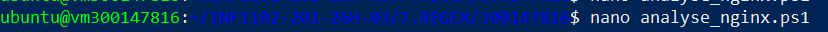
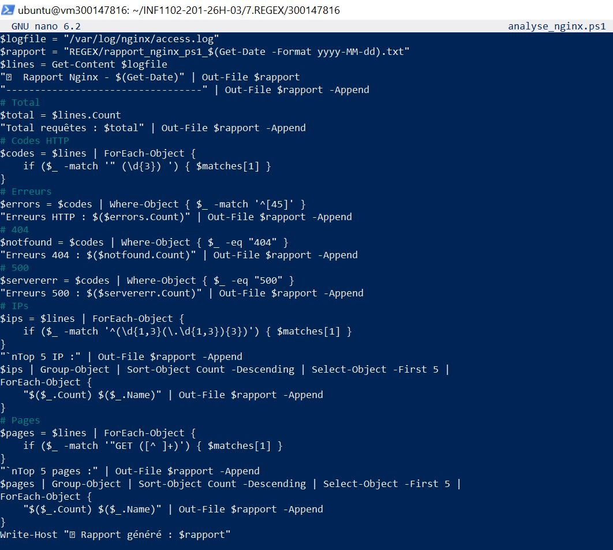
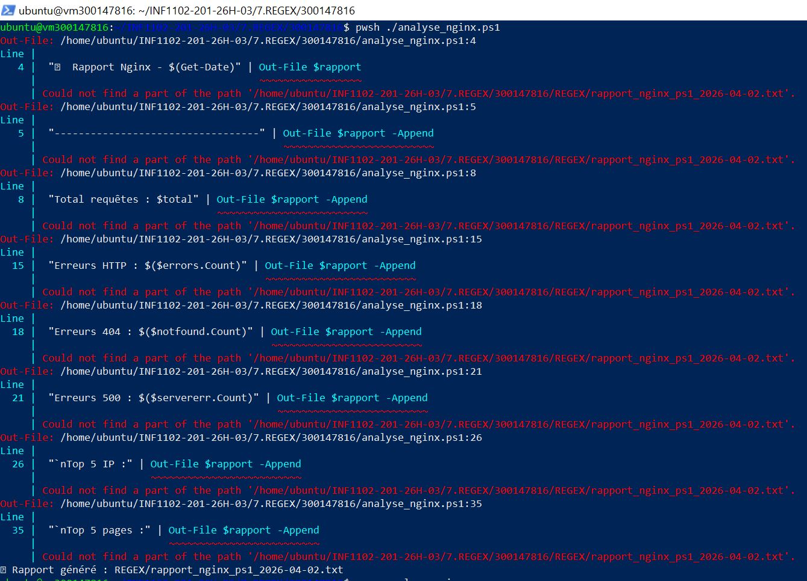
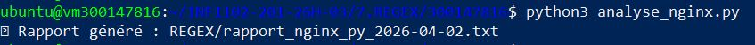
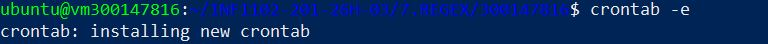
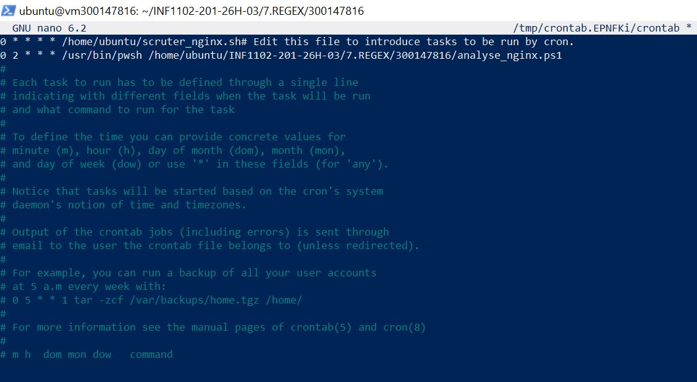
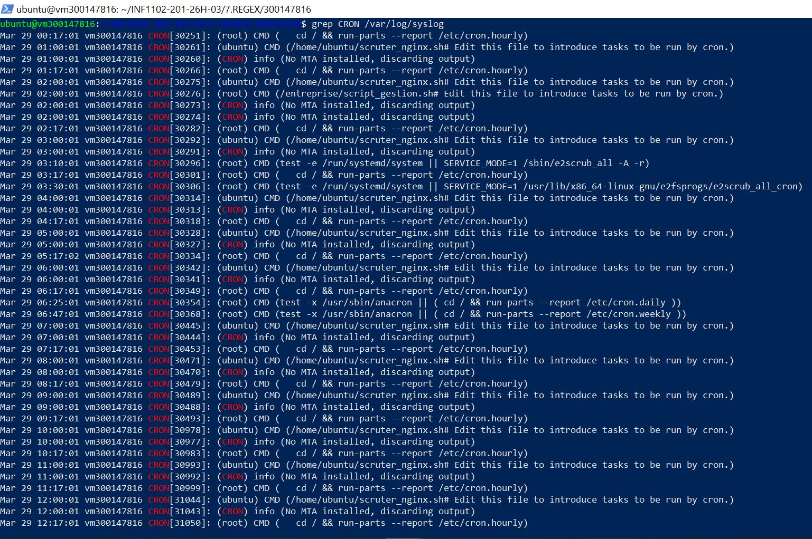

📝 Travail Pratique : Analyse de Logs (REGEX)

👤 Informations de l'étudiant

- **Nom :** HANANE ZERROUKI

- **ID Étudiant (Matricule) :** 300147816

- **Date :** 2 avril 2026

- **Cours :** INF1102 - Systèmes d'exploitation et automatisation

**🎯 Objectif de l'activité**

L'objectif est d'utiliser les Expressions Régulières (REGEX) pour extraire des données critiques (adresses IP, pages consultées, codes d'erreurs) depuis les journaux d'accès d'un serveur Nginx, puis d'automatiser cette tâche.

L’analyse est réalisée à l’aide de deux technologies :

- PowerShell

- Python

Le projet inclut également une automatisation de l’exécution des scripts.

**📂 Structure du Répertoire**

300147816/
├── analyse_nginx.ps1      # Script d'extraction PowerShell
├── analyse_nginx.py       # Script d'analyse Python
├── README.md              # Documentation du projet
├── REGEX/                 # Dossier des rapports (créé via mkdir)
│   └── rapport_nginx_py_2026-04-02.txt
└── images/                # Captures d'écran des exécutions

**🛠️ Étapes de réalisation**

## 1. Préparation de l'environnement

Avant l'exécution, le dossier de destination a été créé pour éviter les erreurs de chemin :

**⚡ Script PowerShell**

Voici la commande qui permet de créer le fichier **analyse_nginx.ps1** 

qui a le contenu suivant :

**▶️ Exécution**

On éxécute le fichier comme suit:

**🐍 Script Python**

Voici la commande qui permet de créer le fichier **analyse_nginx.py**

qui a le contenu suivant:

[Contenu](./images/44.JPG)

**▶️ Exécution**

On éxécute le fichier comme suit:

**⏰ PARTIE 3 — Automatisatio (Cron)**

## Configuration de la Crontab

La commande suivante permet d'ouvrir l'éditeur de configuration des tâches :

Une tâche planifiée a été ajoutée à la crontab pour exécuter le script chaque nuit à 2h00 :

**🔍 PARTIE 4 — Vérification du service Cron** 

La commande suivante a été utilisée pour confirmer que le démon cron est bien actif sur le système :

**🎓 Compétences développées**

- Expressions régulières (Regex)

- Analyse de logs web

- Scripting PowerShell et Python

- Automatisation des tâches (cron)

- Débogage

**🏁 Conclusion**

Ce projet démontre comment l'automatisation par Regex transforme des journaux bruts en outils de décision. En filtrant les adresses IP et les codes d'erreurs, ces scripts facilitent grandement la surveillance proactive, le diagnostic rapide des pannes et le renforcement de la sécurité des systèmes web.

L'intégration finale dans Cron permet une gestion autonome et rigoureuse, essentielle pour tout administrateur système.

## ✍️ Auteur
**HANANE ZERROUKI** 🆔 Étudiante : 300147816

📅 Mars 2026 —  Laboratoire Analyse de Logs (REGEX)

