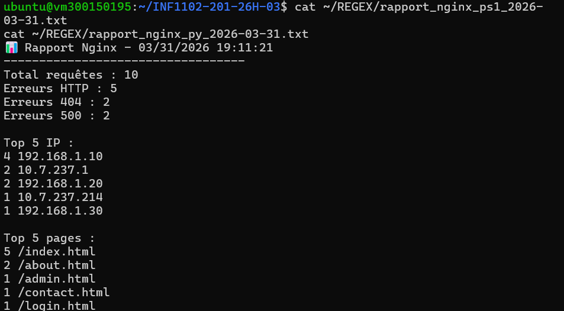
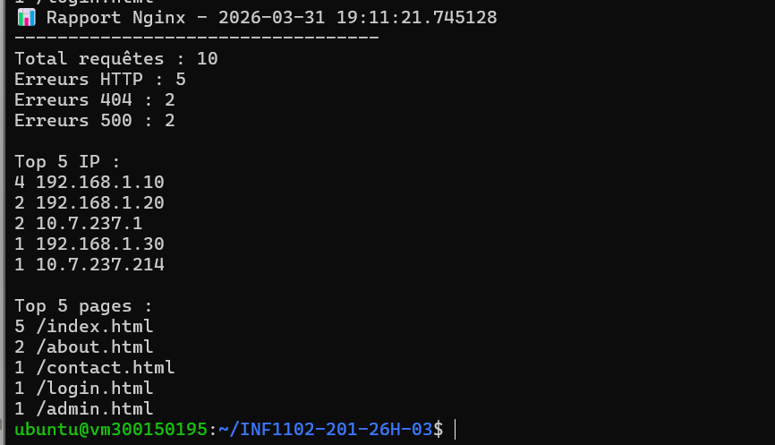
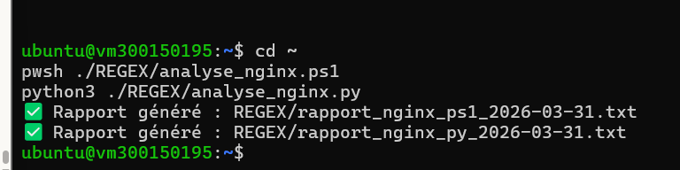

# 300150195 — Amel Zourane

## 📚 TP — Analyse des logs Nginx avec Regex
### Cours : INF1102-201-26H-03

## 🖥️ Informations de la VM

| Élément | Valeur |
|---------|--------|
| Étudiant | Amel Zourane |
| Numéro | 300150195 |
| Machine | vm300150195 |
| IP | 10.7.237.214 |
| OS | Ubuntu 22.04 (Jammy) |

## 📋 Description

Scripts d'analyse des logs Nginx avec expressions régulières.
Génère automatiquement un rapport texte avec PowerShell et Python.

## 📸 Exécution des scripts



## 📊 Rapport PowerShell



## 📊 Rapport Python



## ▶️ Exécution
```bash
pwsh ./REGEX/analyse_nginx.ps1
python3 ./REGEX/analyse_nginx.py
```

## ⏰ Cron
```bash
0 2 * * * /usr/bin/pwsh /home/ubuntu/REGEX/analyse_nginx.ps1
```
