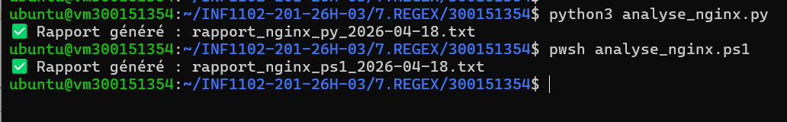

🧾 7.REGEX – Analyse des journaux Nginx
🎯 Objectif

L’objectif de cette activité est d’exploiter des expressions régulières (Regex) afin d’analyser des logs Nginx, en utilisant à la fois PowerShell et Python.

⚙️ Scripts développés

Deux programmes ont été réalisés :

🔹 Version PowerShell
analyse_nginx.ps1
🔹 Version Python
analyse_nginx.py

Ces scripts permettent notamment de :

lire le fichier /var/log/nginx/access.log
déterminer le nombre total de requêtes
repérer les codes d’erreur HTTP (4xx et 5xx)
compter précisément les erreurs 404 et 500
identifier les 5 adresses IP les plus actives
extraire les 5 ressources les plus sollicitées
🚀 Lancement des scripts
PowerShell
pwsh analyse_nginx.ps1
Python
python3 analyse_nginx.py
📸 Exemple d’exécution

👉 Cette illustration présente :

l’exécution des deux scripts
la production des rapports
la bonne utilisation des expressions régulières
📂 Résultats générés

Une fois les scripts exécutés, les fichiers suivants sont créés :

rapport_nginx_ps1_YYYY-MM-DD.txt
rapport_nginx_py_YYYY-MM-DD.txt

Ils regroupent :

un résumé global de l’activité
les erreurs HTTP détectées
les IP les plus actives
les pages les plus demandées
🔍 Consultation des rapports
cat rapport_nginx_ps1_*.txt
cat rapport_nginx_py_*.txt
