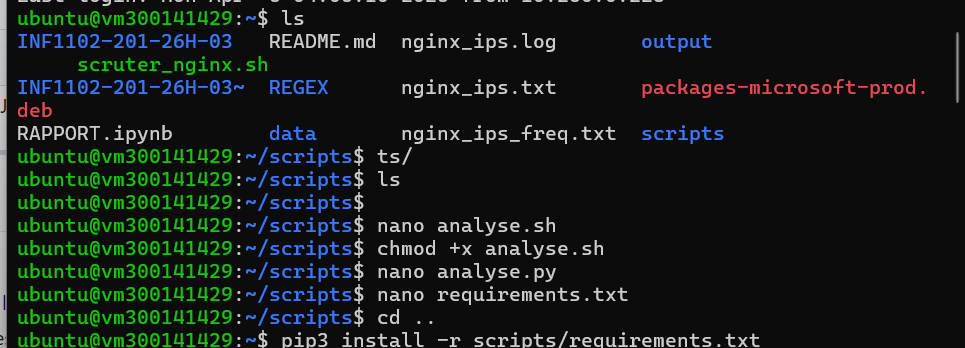
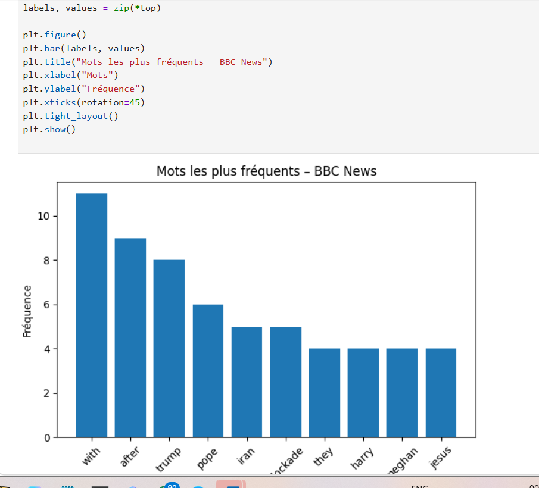
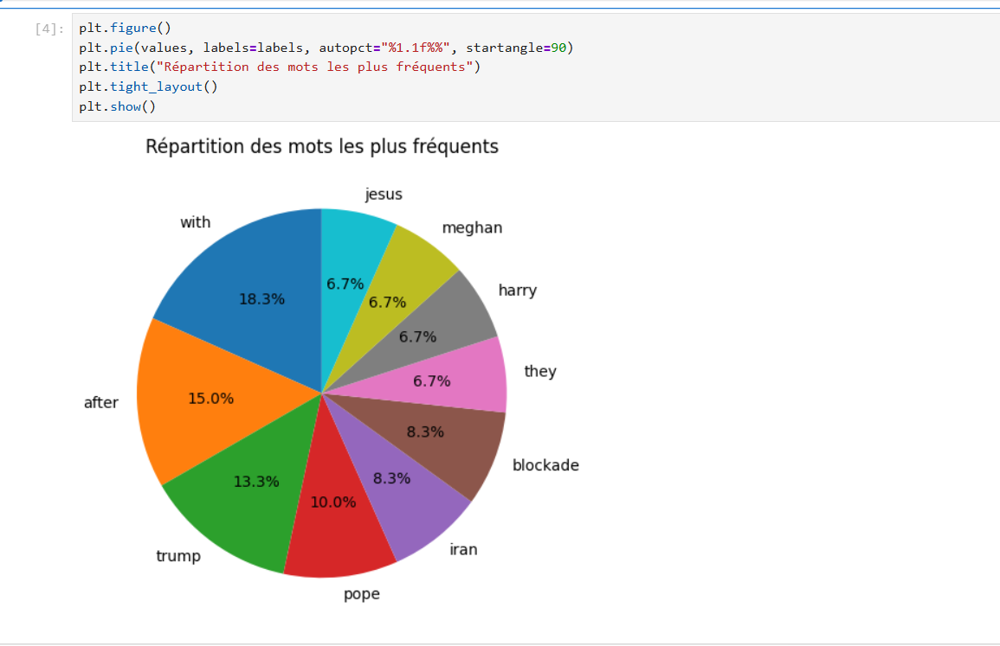
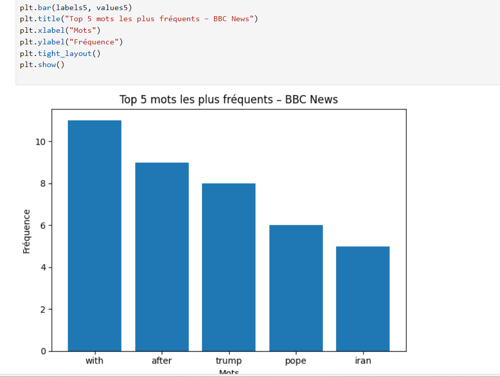
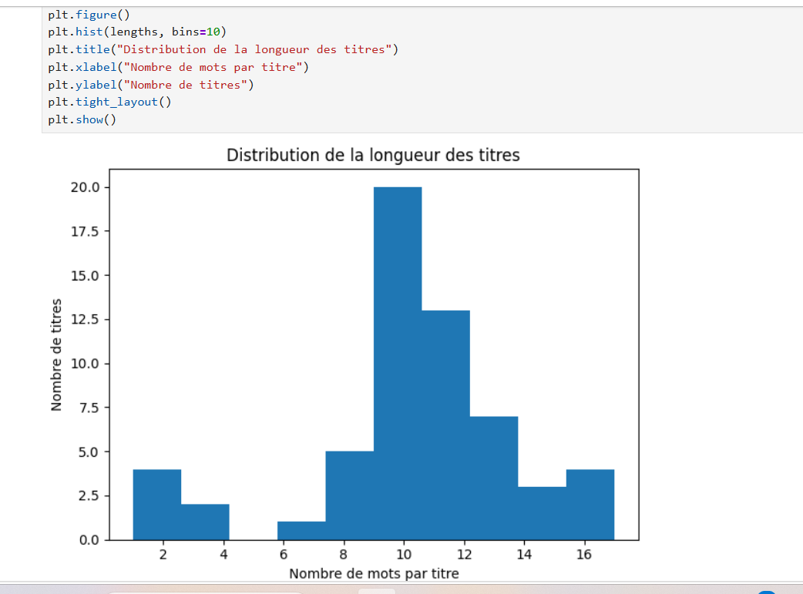

# 📽️ Projet – Scraping et analyse de BBC News

## 👤 Elhadji Arona Barry
Nom : Elhadji Arona Barry  
Matricule : 300141429  
Cours : INF1102  
Session : Hiver 2026  

---

## 🎯 Objectif du projet
Ce projet a pour objectif de démontrer l’utilisation de plusieurs langages de script
(**Bash, PowerShell et Python**) pour automatiser :
- la récupération de titres de nouvelles depuis le site BBC News
- l’analyse des mots les plus fréquents
- la génération d’un rapport texte
- la création de visualisations graphiques avec Jupyter Notebook

---

## 🛠️ Technologies utilisées
- **Bash** : exécution du script principal
- **PowerShell (pwsh)** : exécution alternative de l’analyse
- **Python 3** : scraping et traitement des données
- **BeautifulSoup** : extraction des données HTML
- **Matplotlib** : génération de graphiques
- **Jupyter Notebook** : rapport et visualisation des résultats

---

## 📂 Structure du projet

 Exécution avec PowerShell

```powershell
pwsh scripts/analyse.ps1
```

Ces commandes :

récupèrent automatiquement les titres depuis BBC News
génèrent le fichier data/articles.json
produisent le rapport texte output/rapport.txt

📊 Analyse et visualisation


Le fichier RAPPORT.ipynb contient :

le chargement des données
le calcul des statistiques
plusieurs graphiques (fréquence des mots, répartition, distributions)
une analyse écrite des résultats obtenus


Ce graphique représente les dix mots les plus fréquents présents dans les titres des nouvelles extraites du site BBC News.
L’axe horizontal correspond aux mots, tandis que l’axe vertical indique leur fréquence d’apparition.
Ce type de visualisation permet d’identifier rapidement les termes dominants dans l’actualité analysée et de mettre en évidence les sujets les plus récurrents dans les titres.


🥧 Graphe 2 — Répartition des mots les plus fréquents (Diagramme en secteurs)

Description :

Ce diagramme en secteurs illustre la répartition relative des dix mots les plus fréquents dans les titres de BBC News.
Chaque secteur représente la proportion d’un mot par rapport à l’ensemble du top 10.
Cette visualisation permet de comparer visuellement l’importance relative de chaque mot et de constater que certains termes occupent une place dominante dans les titres.


📊 Graphe 3 — Top 5 des mots les plus fréquents

Description :

Ce graphique présente uniquement les cinq mots les plus fréquents afin de se concentrer sur les termes les plus significatifs.
En réduisant le nombre de mots affichés, la lecture devient plus claire et l’analyse plus ciblée.
Ce graphe met en évidence les sujets majeurs traités par les nouvelles et permet une interprétation plus rapide des tendances dominantes.


📈 Graphe 4 — Distribution de la longueur des titres

Description :

Ce graphique montre la distribution du nombre de mots contenus dans les titres de BBC News.
Chaque barre représente le nombre de titres ayant une longueur donnée.
Cette analyse permet de mieux comprendre le style rédactionnel des titres, notamment s’ils sont courts et percutants ou plus longs et descriptifs.


