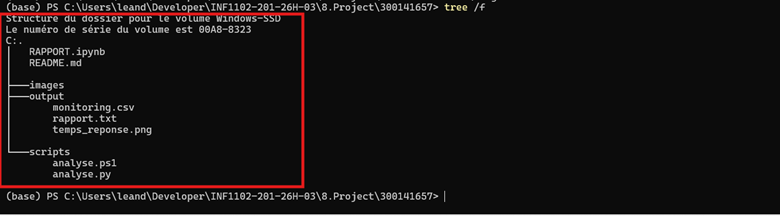
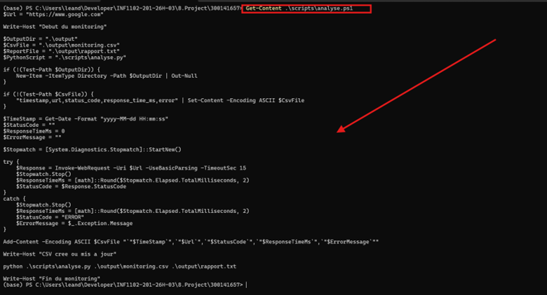
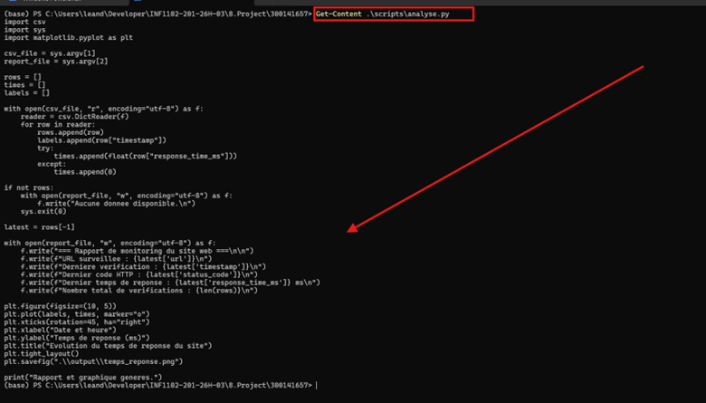
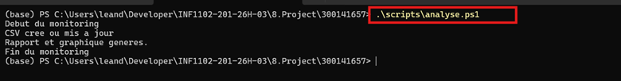
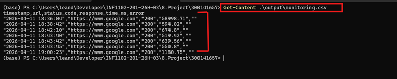
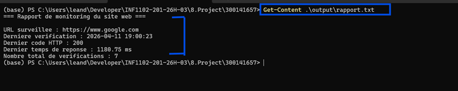
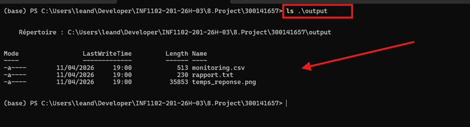
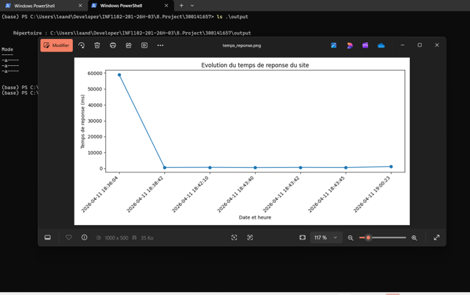
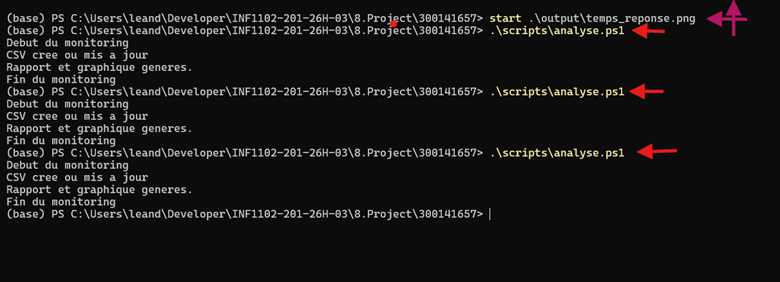
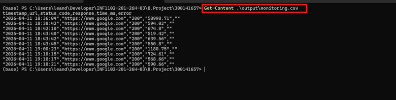

Structure du projet
300141657/
│
├── scripts/
│   ├── analyse.ps1
│   └── analyse.py
│
├── output/
│   ├── monitoring.csv
│   ├── rapport.txt
│   └── temps_reponse.png
│
├── images/
│   ├── Image23.png
│   ├── Image24.png
│   ├── Image25.png
│   ├── Image26.png
│   ├── Image27.png
│   ├── Image28.png
│   ├── Image29.png
│   ├── Image30.png
│   ├── Image31.png
│   └── Image32.png
│
├── RAPPORT.ipynb
└── README.md
Description des fichiers
scripts/analyse.ps1

Ce script PowerShell lance le monitoring du site web. Il envoie une requête HTTP, mesure le temps de réponse, enregistre les données dans monitoring.csv, puis appelle le script Python.

scripts/analyse.py

Ce script Python lit le fichier CSV généré, crée un rapport texte dans rapport.txt, puis génère le graphique temps_reponse.png.

output/monitoring.csv

Ce fichier contient l’historique des vérifications effectuées sur le site web.

output/rapport.txt

Ce fichier contient un résumé du dernier état observé : URL, heure de vérification, code HTTP, temps de réponse et nombre total de vérifications.

output/temps_reponse.png

Ce graphique montre l’évolution du temps de réponse du site web à travers plusieurs exécutions.

RAPPORT.ipynb

Ce notebook Jupyter est destiné à présenter l’analyse des résultats et les visualisations complémentaires.

Commandes utilisées
Afficher la structure du projet
tree /f
Afficher le script PowerShell
Get-Content .\scripts\analyse.ps1
Afficher le script Python
Get-Content .\scripts\analyse.py
Exécuter le monitoring
.\scripts\analyse.ps1
Afficher l’historique CSV
Get-Content .\output\monitoring.csv
Afficher le rapport texte
Get-Content .\output\rapport.txt
Vérifier les fichiers générés
ls .\output
Ouvrir le graphique
start .\output\temps_reponse.png
Fonctionnement du projet

Le projet suit les étapes suivantes :

Le script analyse.ps1 vérifie la disponibilité du site web.
Il mesure le temps de réponse HTTP.
Il enregistre les données dans monitoring.csv.
Il appelle analyse.py.
Le script Python génère rapport.txt.
Il produit aussi un graphique temps_reponse.png.
Les résultats peuvent ensuite être analysés dans RAPPORT.ipynb.
Résultats obtenus

Les différentes exécutions ont permis d’obtenir plusieurs mesures du temps de réponse du site web.
Le code HTTP observé est 200, ce qui confirme que le site surveillé est disponible.

Exemple de résumé produit :

=== Rapport de monitoring du site web ===

URL surveillee : https://www.google.com
Derniere verification : 2026-04-11 19:00:23
Dernier code HTTP : 200
Dernier temps de reponse : 1180.75 ms
Nombre total de verifications : 7
Captures d’écran
1. Structure complète du projet

  

Cette capture montre l’organisation complète du projet avec les dossiers scripts, output, images, ainsi que les fichiers README.md et RAPPORT.ipynb.

2. Contenu du script PowerShell analyse.ps1

  

Cette capture présente le script PowerShell chargé de lancer le monitoring du site web et de déclencher l’analyse Python.

3. Contenu du script Python analyse.py

  

Cette capture montre le script Python qui lit le fichier CSV, génère le rapport texte et crée le graphique des temps de réponse.

4. Exécution du script de monitoring

  

Cette capture confirme que le script PowerShell s’exécute correctement, met à jour le CSV et génère le rapport et le graphique.

5. Contenu du fichier monitoring.csv

  

Cette capture montre les différentes mesures enregistrées, avec la date, l’URL surveillée, le code HTTP et le temps de réponse.

6. Contenu du fichier rapport.txt

  

Cette capture présente le rapport généré automatiquement à partir des données collectées.

7. Vérification des fichiers générés dans output

  

Cette capture confirme que les trois fichiers attendus sont bien générés :

monitoring.csv
rapport.txt
temps_reponse.png
8. Graphique du temps de réponse

  

Cette capture montre le graphique produit automatiquement à partir des données du monitoring.

9. Exécutions répétées du script

  

Cette capture montre plusieurs exécutions successives du script afin d’enrichir les données dans le fichier CSV.

10. Historique mis à jour après plusieurs tests

  

Cette capture montre l’enrichissement progressif du fichier monitoring.csv après plusieurs vérifications du site.

Analyse

Le projet démontre bien l’utilisation combinée de deux langages de script :

PowerShell pour l’exécution principale et la journalisation
Python pour le traitement des données et la génération du graphique

Cette approche permet d’automatiser une tâche réelle de monitoring web tout en produisant des résultats lisibles et exploitables.

Conclusion

Ce projet m’a permis de mettre en pratique l’utilisation de PowerShell et Python dans un même workflow d’automatisation.

Grâce à ce travail, j’ai pu :

surveiller la disponibilité d’un site web
mesurer le temps de réponse HTTP
enregistrer les résultats dans un fichier CSV
générer un rapport texte
produire un graphique de suivi

Ce projet répond donc bien à l’objectif demandé : utiliser les langages de script appris en cours dans une situation concrète et utile.
