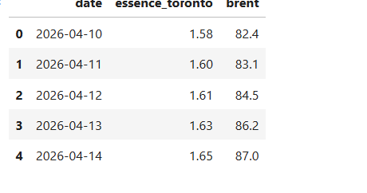
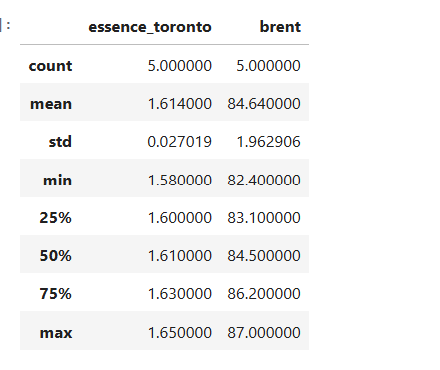
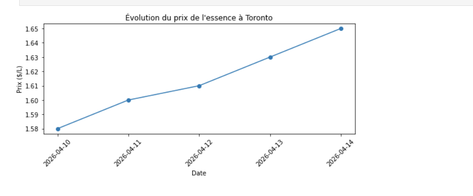
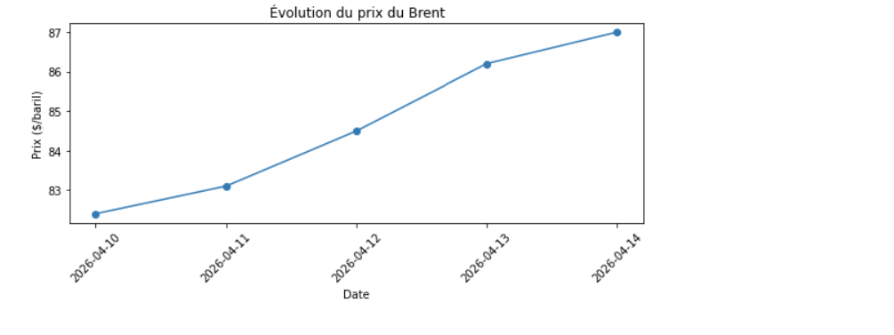
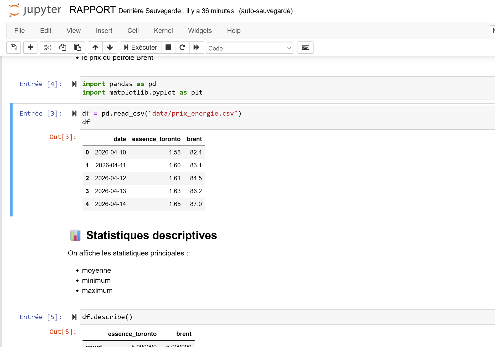

# ⛽ Projet — Analyse du prix de l’essence à Toronto

## 👤 Étudiante

* Identifiant : 300141716
* Nom : Nabila Oulad-Bouih
* Cours : INF1102 — Programmation système
* Thème : Analyse du prix de l’essence et du pétrole

---

## 🎯 Objectif du projet

Ce projet a pour objectif d’analyser le prix de l’essence à Toronto en lien avec le prix du pétrole mondial (Brent), dans un contexte géopolitique marqué par les tensions au Moyen-Orient.

L’objectif est de :

* comprendre l’impact du pétrole sur les prix locaux
* automatiser la génération d’un rapport
* analyser des données simples avec Python

---

## 📦 Livrables

* `scripts/analyse.py` → script principal Python
* `scripts/analyse.sh` → script bash (optionnel)
* `data/prix_energie.csv` → données utilisées
* `output/rapport.txt` → rapport généré automatiquement
* `RAPPORT.ipynb` → analyse avec statistiques et graphiques
* `images/` → captures d’écran
* `README.md` → documentation du projet

---

## 📁 Structure du projet

```
300141716/
├── scripts/
│   ├── analyse.py
│   └── analyse.sh
├── data/
│   └── prix_energie.csv
├── images/
│   ├── tableau.png
│   ├── statistiques.png
│   ├── graphique_essence.png
│   ├── graphique_brent.png
│   └── notebook.png
├── output/
│   └── rapport.txt
├── RAPPORT.ipynb
└── README.md
```

---

## ⚙️ Installation

Aucune dépendance externe nécessaire.

Vérifier Python :

```bash
python --version
```

---

## 🚀 Exécution

### 🔹 Exécuter le script Python

```bash
python scripts/analyse.py
```

### 🔹 Afficher le rapport

Windows :

```powershell
Get-Content output\rapport.txt -Encoding utf8
```

Linux / VM :

```bash
cat output/rapport.txt
```

---

## 📊 Analyse des données

Le projet utilise un fichier CSV contenant :

* les dates
* le prix de l’essence à Toronto
* le prix du pétrole Brent

Le notebook permet de :

* charger les données avec Python
* afficher un tableau (DataFrame)
* calculer des statistiques (moyenne, min, max)
* visualiser les données avec des graphiques

---

## 📈 Résultats

Le projet génère :

* un tableau des données
* des statistiques descriptives
* un graphique du prix de l’essence
* un graphique du prix du Brent

Ces résultats montrent une évolution similaire entre les deux variables.

---

## 🔍 Interprétation

On observe que :

* le prix de l’essence augmente progressivement
* le prix du Brent augmente également
* les deux évoluent dans le même sens

➡️ Cela montre qu’une hausse du pétrole brut peut influencer les prix locaux de l’essence.

---

## 🌍 Contexte géopolitique

Le prix du pétrole est influencé par :

* les tensions au Moyen-Orient
* les conflits internationaux
* les décisions de production (OPEP)

➡️ Une augmentation du prix du pétrole peut entraîner une hausse du prix de l’essence.

---

## 📓 Notebook Jupyter

Le fichier `RAPPORT.ipynb` contient :

* le chargement des données
* les statistiques descriptives
* les graphiques
* une analyse des résultats
* une conclusion

---

## 📸 Captures

### Tableau des données



### Statistiques



### Graphique essence



### Graphique Brent



### Notebook



---

## 🧠 Compétences développées

* Python scripting
* Analyse de données
* Utilisation de pandas et matplotlib
* Visualisation de données
* Organisation de projet
* Documentation technique

---

## ✅ Conclusion

Ce projet montre comment :

* analyser des données avec Python
* automatiser un rapport
* créer des visualisations
* comprendre un phénomène réel

Les événements géopolitiques peuvent influencer le prix du pétrole, ce qui a un impact direct sur les prix de l’essence à Toronto.

---

