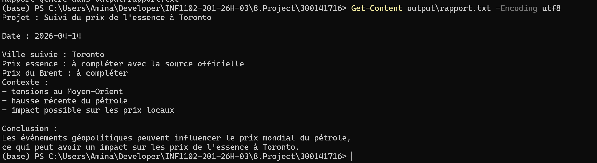

# ⛽ Gas Price Analysis — Toronto

## 👤 Student

* Name: Nabila Oulad-Bouih
* ID: 300141716
* Course: INF1102 — System Programming

---

## 🎯 Project Goal

This project analyzes gas prices in Toronto and compares them with global oil prices (Brent).

It also shows how geopolitical events (Middle East tensions) can impact local prices.

---

## 📁 Project Structure

```
300141716/
├── scripts/
│   ├── analyse.py
│   └── analyse.sh
├── data/
│   └── prix_energie.csv
├── output/
│   └── rapport.txt
├── images/
├── RAPPORT.ipynb
└── README.md
```

---

## ⚙️ Run the Project

### ▶️ Run Python Script

```powershell
python scripts/analyse.py
```

### 📄 Output

```powershell
Get-Content output\rapport.txt -Encoding utf8
```

Example:

```
Projet : Suivi du prix de l'essence à Toronto
Date : 2026-04-14
Ville suivie : Toronto
...
```

---

## 📊 Data Analysis (Notebook)

The notebook uses:

* `pandas` → to load and analyze data
* `matplotlib` → to create graphs

---

### 📋 Load Data

```python
df = pd.read_csv("data/prix_energie.csv")
df
```

---

### 📈 Statistics

```python
df.describe()
```

---

### 📉 Graph (Gas Price)

```python
plt.plot(df["date"], df["essence_toronto"])
```

---

### 📉 Graph (Brent)

```python
plt.plot(df["date"], df["brent"])
```

---

## 📸 Results

### 🔹 Table


### 🔹 Statistics


### 🔹 Gas Graph


### 🔹 Brent Graph


---

## 💻 PowerShell Execution

### Script execution


### Report output



---

## 📓 Notebook


---

## 🧠 Key Takeaways

* Gas prices follow global oil trends
* Brent price increases → gas price increases
* External events (Middle East) affect local economy

---

## ✅ Conclusion

This project shows how to:

* automate a report using Python
* analyze simple data
* visualize trends
* connect global events to real-life impact

---
