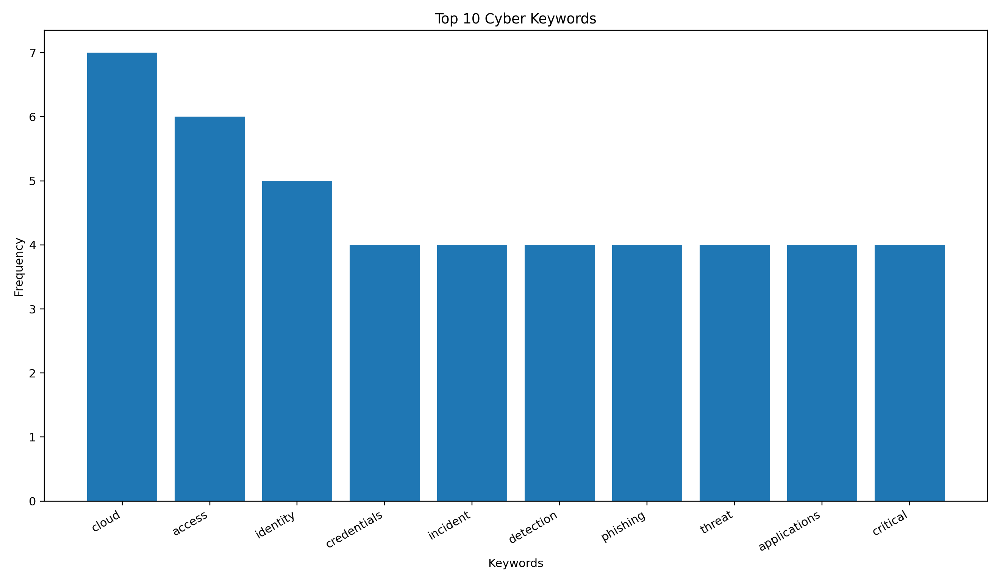
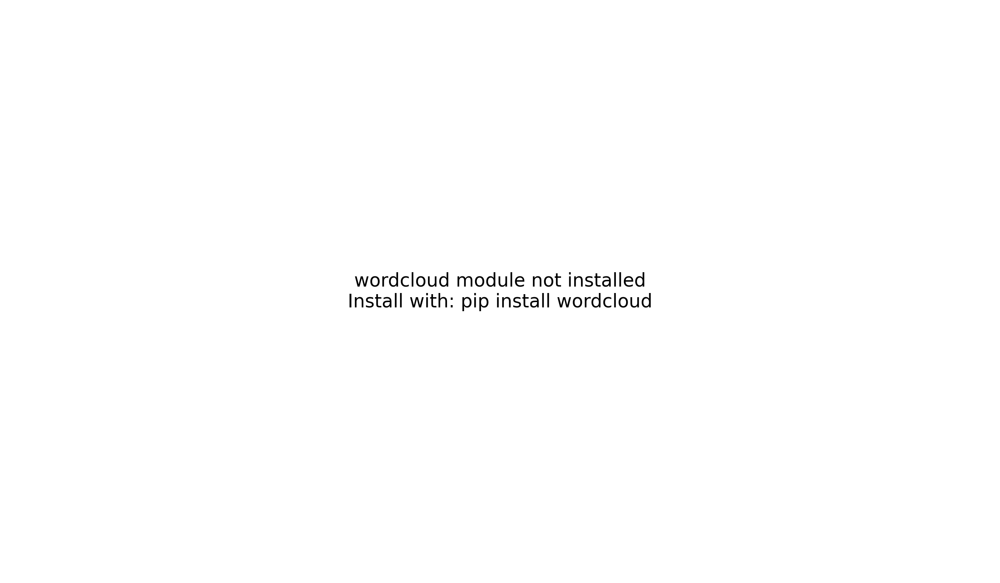
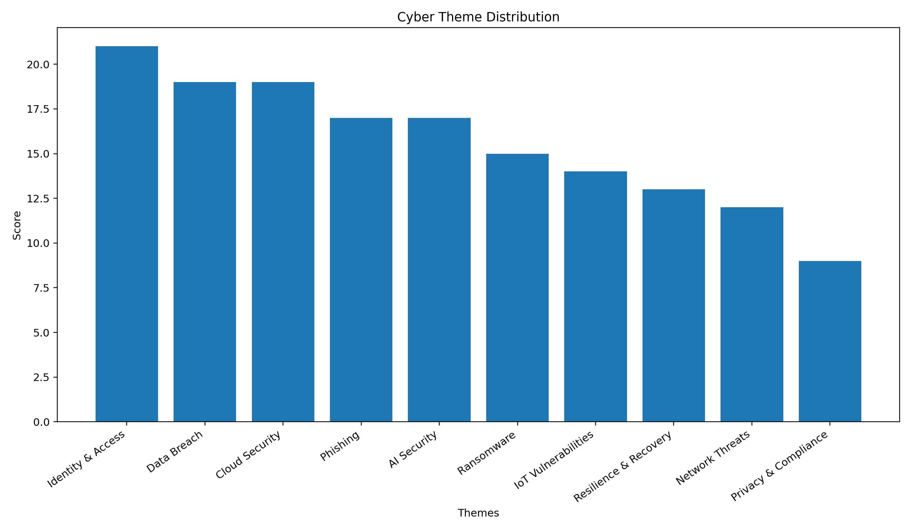
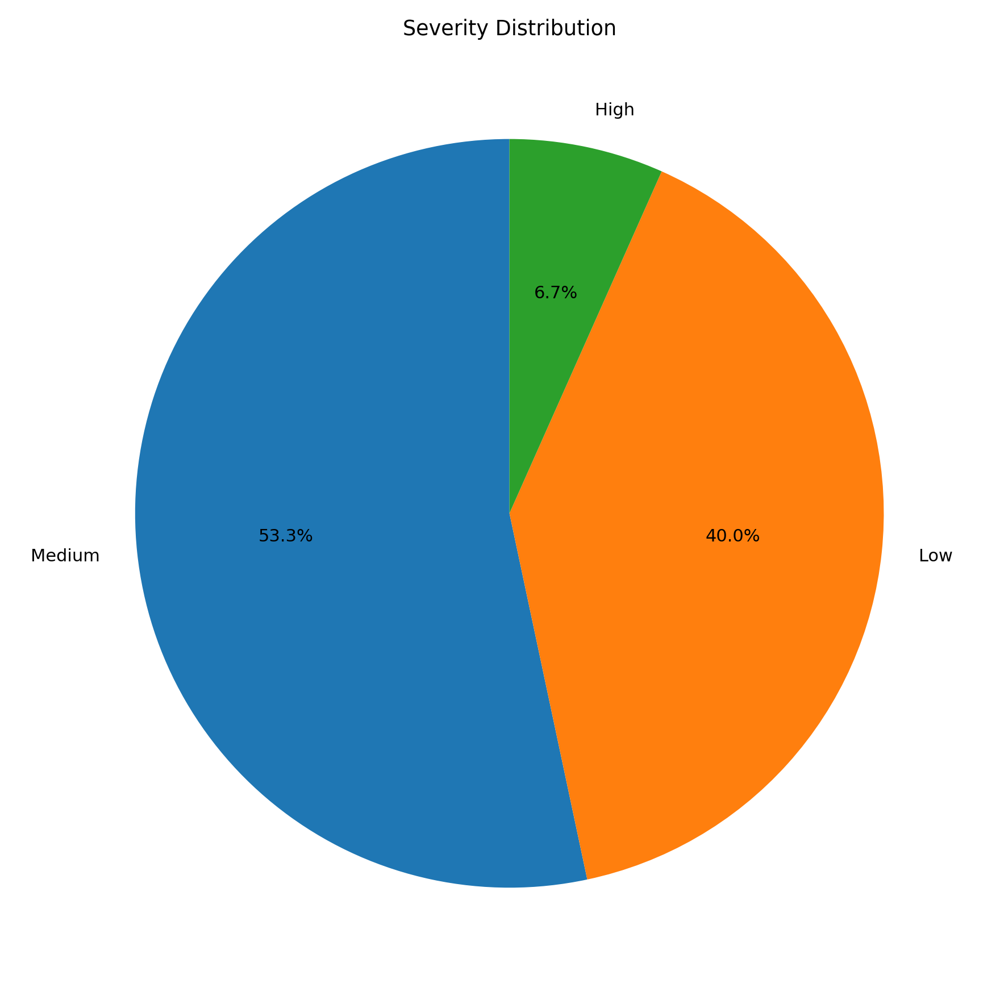
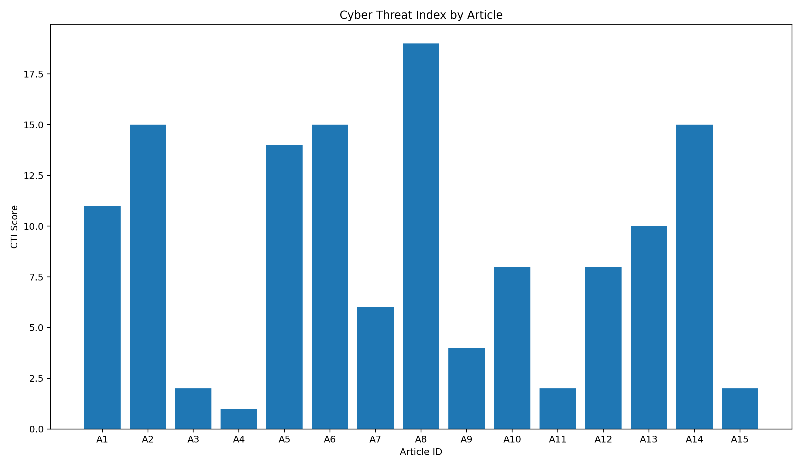

# 🚀 CyberPulse Intelligence

## Automated Cybersecurity News Monitoring & Threat Trend Analysis

---

## 👨‍🎓 Student Information

* **Name:** Abdou Karim NIANG
* **Student ID:** 300141858
* **Course:** Programmation de systèmes (INF1102)

---

## 📌 Project Overview

CyberPulse Intelligence is an automated cybersecurity analysis system designed to transform raw cybersecurity news into structured cyber threat intelligence.

The project processes a dataset of cybersecurity articles and extracts meaningful insights such as:

* dominant cyber threats
* severity levels
* keyword trends
* cyber risk scoring

It simulates a simplified **Cyber Threat Intelligence (CTI)** workflow used in real-world environments.

---

## 🎯 Project Objectives

The main objectives of this project are:

* Automate cybersecurity news analysis
* Clean and preprocess textual data
* Extract top cybersecurity keywords
* Classify articles into cyber themes
* Evaluate threat severity
* Compute a **Cyber Threat Index (CTI)**
* Generate visual analytics
* Produce structured outputs (TXT, CSV, PNG)
* Document the whole process using Jupyter Notebook

---

## 🗂️ Project Structure

```
300141858/
│   README.md
│   RAPPORT.ipynb
│
├── data/
│   └── news_data.json
│
├── output/
│   ├── article_scores.png
│   ├── histogram.png
│   ├── rapport.txt
│   ├── severity_pie.png
│   ├── summary.csv
│   ├── themes_bar.png
│   └── wordcloud.png
│
└── scripts/
    ├── analyse.py
    └── analyse.sh
```

---

## 📥 Input Data

The dataset is stored in:

```
data/news_data.json
```

Each article contains:

* `id`
* `source`
* `title`
* `summary`
* `date`

The dataset covers multiple cybersecurity domains:

* ransomware
* phishing
* cloud security
* identity & access management
* data breaches
* AI-driven security

---

## ⚙️ Processing Workflow

The Python script performs:

1. JSON data loading
2. Text normalization and cleaning
3. Tokenization
4. Stopword removal
5. Keyword frequency extraction
6. Cyber theme classification
7. Severity scoring (Low / Medium / High)
8. CTI (Cyber Threat Index) calculation
9. Visualization generation
10. Report and CSV export

---

## 📊 Cyber Threat Index (CTI)

The **CTI score** is a custom metric used to evaluate cyber risk intensity.

It is based on weighted cybersecurity vocabulary:

* 🔴 High-risk keywords → weight 3
* 🟠 Medium-risk keywords → weight 2
* 🟢 Low-risk keywords → weight 1

This allows prioritization of the most critical articles.

---

## 📤 Output Files

After execution, the project generates:

### 📄 rapport.txt

Contains:

* Executive summary
* Top keywords
* Theme distribution
* Severity distribution
* Top critical articles
* Analytical interpretation
* Conclusion

---

### 📊 summary.csv

Structured dataset including:

* theme classification
* severity level
* CTI score

---

## 📈 Visualizations

### Keyword Distribution


### Word Cloud


### Theme Distribution


### Severity Distribution


### Cyber Threat Index


---

## 🧰 Technologies Used

* Python 3
* Bash
* JSON
* CSV
* Matplotlib
* WordCloud
* Jupyter Notebook
* VS Code

---

## 📦 Installation

Install required libraries:

```bash
python -m pip install matplotlib wordcloud
```

---

## ▶️ Execution

### Run Python script:

```bash
python scripts/analyse.py
```

### Run Bash script:

```bash
bash scripts/analyse.sh
```

---

## 🧠 Analytical Value

This project demonstrates how programming can support cybersecurity analysis by combining:

* automation
* text processing
* data analysis
* visualization
* reporting

It provides a simplified but realistic model of a cyber threat intelligence pipeline.

---

## 🔮 Future Improvements

* Integration with real-time APIs or RSS feeds
* Time-series analysis of cyber threats
* Sentiment analysis
* Named Entity Recognition (NER)
* Dashboard integration (Power BI / Tableau)
* Scheduled execution (cron jobs)

---

## ✅ Conclusion

CyberPulse Intelligence demonstrates how scripting, data processing, and analytical techniques can be combined to build a complete cybersecurity intelligence solution.

It reflects real-world practices in:

* threat monitoring
* risk evaluation
* data-driven decision-making

---

🔥 **This project represents a structured, automated, and professional cybersecurity analysis workflow.**
