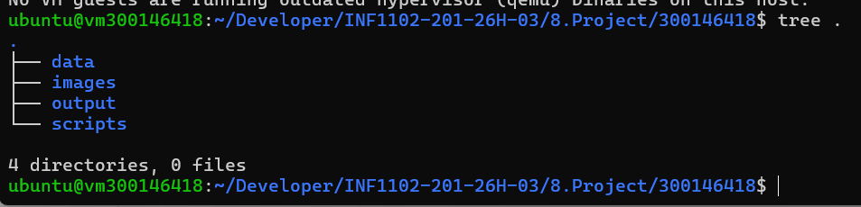
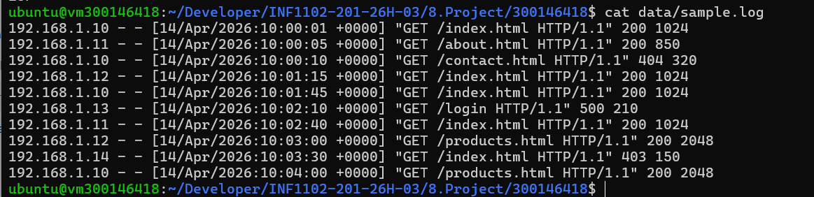
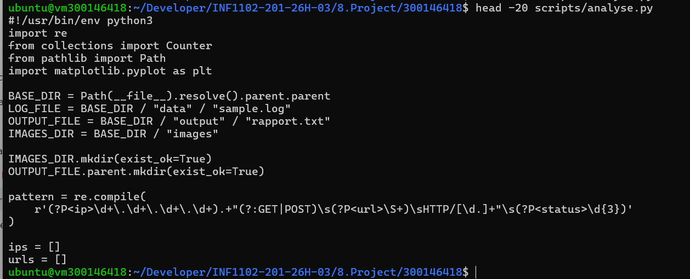
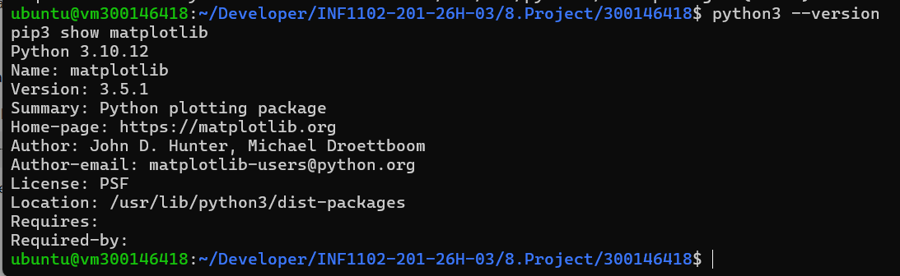

# 📊 Projet INF1102 - Analyse de logs

## 👩‍💻 Étudiante
Ikram Sidhoum  
ID : 300146418  

---

## 🎯 Objectif

Ce projet consiste à analyser un fichier de logs web en utilisant :

- Python 🐍
- PowerShell 💻
- Jupyter Notebook 📒

Le but est de :
- extraire les informations importantes
- générer un rapport texte
- produire des graphiques

---

## 📁 Structure du projet

``` bash
300146418/
├── scripts/
├── data/
├── output/
├── images/
├── RAPPORT.ipynb
└── README.md
```


## 📄 Fichier de données

Le fichier `sample.log` contient les logs à analyser.

📷 Exemple :



---

## 🧠 Script Python

Le script `analyse.py` :

- lit le fichier log
- extrait IP, URL et status HTTP
- génère un rapport
- crée des graphiques

📷 Code Python :



---

## ⚙️ Script PowerShell

Le script `analyse.ps1` permet d'exécuter automatiquement l’analyse.

📷 Script PowerShell :



---

## 📊 Résultats

### 📄 Rapport texte

Le fichier `output/rapport.txt` contient :

- nombre total de requêtes
- top IP
- top URLs
- codes HTTP

📷 Résultat :



---

### 📈 Graphiques

Les graphiques sont générés avec matplotlib :

- Top IP
- Top URLs
- Codes HTTP


---

## 📒 Notebook Jupyter

Le fichier `RAPPORT.ipynb` contient :

- analyse détaillée
- visualisations
- interprétation des résultats

---

## ⚠️ Problèmes rencontrés

### 1. pandas non détecté
Solution : installation dans le kernel Jupyter

### 2. variables non définies
Solution : exécuter les cellules dans le bon ordre

### 3. conflit NumPy / matplotlib
Solution : downgrade de NumPy

### 4. warning Axes3D
Impact : aucun (graphiques 2D uniquement)

---

## ✅ Conclusion

Ce projet montre :

- l’utilisation de scripts pour automatiser une analyse
- la manipulation de données avec Python
- la création de visualisations
- la production d’un rapport structuré

Ce type de projet est utilisé en entreprise pour :
- surveiller les serveurs
- détecter les erreurs
- analyser le trafic web

---
