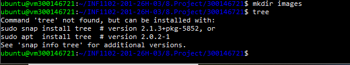
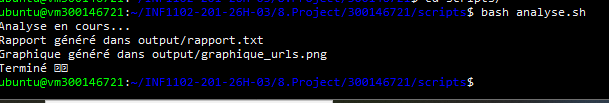
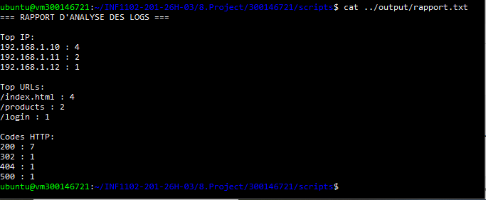
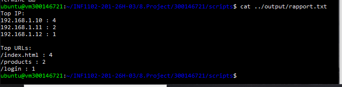

# 📊 Projet Bash + Python — Analyse de fichier Log

**Étudiant :** 300146721  
**Cours :** INF1102-201-26H-03  
**VM :** `ubuntu@vm300146721` — IP : `10.7.237.211`

---

## 1. 🎯 Objectif

Analyser un fichier log (`data/sample.log`) à l'aide d'un script Bash et d'un script Python afin de générer automatiquement :

- `output/rapport.txt` — statistiques : Top IPs, Top URLs, Codes HTTP
- `output/graphique_urls.png` — graphique des URLs les plus visitées
- `RAPPORT.ipynb` — rapport Jupyter avec visualisations et commentaires

---

## 2. 🗂️ Structure du projet

```
300146721/
│
├── scripts/
│   ├── analyse.sh          # Script Bash principal
│   ├── analyse.py          # Script Python appelé par Bash
│   └── requirements.txt    # Librairies Python utilisées
│
├── data/
│   └── sample.log          # Fichier de logs pour les tests
│
├── output/
│   ├── rapport.txt         # Rapport texte généré automatiquement
│   └── graphique_urls.png  # Graphique généré automatiquement
│
├── images/                 # Captures d'écran du projet
├── RAPPORT.ipynb           # Rapport Jupyter Notebook
└── README.md               # Ce fichier
```

Création du dossier `images/` et vérification de la structure sur la VM :



---

## 3. 📝 Code source complet

### `scripts/analyse.py`

```python
import sys
import re
from collections import Counter
import matplotlib.pyplot as plt

log_file = sys.argv[1]

ip_counter   = Counter()
url_counter  = Counter()
code_counter = Counter()

pattern = r'(\d+\.\d+\.\d+\.\d+).*"[A-Z]+\s(.*?)\sHTTP/[\d.]+"\s(\d{3})'

with open(log_file) as f:
    for line in f:
        match = re.search(pattern, line)
        if match:
            ip   = match.group(1)
            url  = match.group(2)
            code = match.group(3)

            ip_counter[ip]     += 1
            url_counter[url]   += 1
            code_counter[code] += 1

with open("../output/rapport.txt", "w") as f:
    f.write("=== RAPPORT D'ANALYSE DES LOGS ===\n\n")

    f.write("Top IP:\n")
    for ip, count in ip_counter.most_common(3):
        f.write(f"{ip} : {count}\n")

    f.write("\nTop URLs:\n")
    for url, count in url_counter.most_common(3):
        f.write(f"{url} : {count}\n")

    f.write("\nCodes HTTP:\n")
    for code, count in code_counter.items():
        f.write(f"{code} : {count}\n")

# Graphique des URLs
urls   = list(url_counter.keys())
values = list(url_counter.values())

plt.figure(figsize=(8, 5))
plt.bar(urls, values, color='steelblue')
plt.title("Top URLs")
plt.xlabel("URL")
plt.ylabel("Nombre de requêtes")
plt.tight_layout()
plt.savefig("../output/graphique_urls.png")
print("Graphique généré dans output/graphique_urls.png")
```

Le script dans l'éditeur `nano` :


---

### `scripts/analyse.sh`

```bash
#!/bin/bash

echo "Analyse en cours..."
python3 analyse.py ../data/sample.log
echo "Rapport généré dans output/rapport.txt"
echo "Terminé 🎉"
```

---

### `scripts/requirements.txt`

```
matplotlib
```

---

## 4. ▶️ Exécution étape par étape

### Étape 1 — Se placer dans le bon dossier

```bash
cd ~/INF1102-201-26H-03/8.Project/300146721/scripts
```

### Étape 2 — Lancer le script Bash

```bash
bash analyse.sh
```

### Étape 3 — Ou lancer Python seul

```bash
python3 analyse.py ../data/sample.log
```

---

## 5. 🐛 Erreurs rencontrées et solutions

### ❌ Erreur 1 — `ModuleNotFoundError: No module named 'matplotlib'`

Lors du premier lancement, le module `matplotlib` était absent :


**Solution :**

```bash
pip install matplotlib --break-system-packages
# ou via requirements.txt
pip install -r requirements.txt --break-system-packages
```

---

### ⚠️ Note — `import sys` tapé dans le terminal Bash

La commande `import sys` tapée directement dans Bash (hors Python) génère des suggestions système, ce qui est normal :


> `import sys` s'utilise **uniquement** à l'intérieur d'un script `.py` ou via l'interpréteur Python (`python3`).

---

### Première exécution (sans graphique) :


### Exécution finale avec graphique ✅ :

Après installation de `matplotlib`, le script génère les deux fichiers de sortie :



---

## 6. 📄 Résultats

### `output/rapport.txt`

```
=== RAPPORT D'ANALYSE DES LOGS ===

Top IP:
192.168.1.10 : 4
192.168.1.11 : 2
192.168.1.12 : 1

Top URLs:
/index.html : 4
/products   : 2
/login      : 1

Codes HTTP:
200 : 7
302 : 1
404 : 1
500 : 1
```





---

## 7. 📦 Transfert des fichiers vers Windows (SCP)

### Vérification de l'IP de la VM

```bash
ip a
# → eth0 : inet 10.7.237.211/23
```

> La VM est sur le réseau interne `10.7.x.x`. Le PC Windows ne peut pas toujours y accéder directement.

---

### ❌ Erreurs SCP rencontrées

**Commande mal formée (doublon) :**

```powershell
# FAUX ❌
scp -r ubuntu@scp -r ubuntu@192.168.1.25:...
# → scp: No such file or directory
```

**Mauvaise IP :**

```powershell
# FAUX ❌ — IP incorrecte
scp -r ubuntu@192.168.1.25:~/INF1102-201-26H-03/8.Project/300146721 C:\Users\HP\Desktop\
# → ssh: connect to host 192.168.1.25 port 22: Connection timed out
```

---

### ✅ Commande SCP correcte

```powershell
scp -r ubuntu@10.7.237.211:~/INF1102-201-26H-03/8.Project/300146721 C:\Users\HP\Desktop\
```

Transfert réussi — tous les fichiers reçus sur le bureau Windows :


---

### Alternative — ZIP depuis la VM (si SCP bloqué par le réseau)

```bash
# Dans la VM
cd ~/INF1102-201-26H-03/8.Project
zip -r 300146721.zip 300146721
```

Puis télécharger le `.zip` via l'interface web Proxmox ou le navigateur de la VM.

---

## 8. 🚀 Push Git depuis Windows

Après avoir copié le dossier `300146721` dans le repo local :

```powershell
cd C:\Users\HP\Developer\INF1102-201-26H-03

git add 8.Project/300146721
git commit -m "Ajout projet final 300146721"
git push origin main
```

---

## 9. ⚙️ Dépendances

| Outil | Version minimale |
|---|---|
| Bash | 5.x |
| Python | >= 3.8 |
| `re`, `collections` | stdlib — inclus par défaut |
| `matplotlib` | >= 3.x |
| Jupyter Notebook | >= 6.x |

Installation des dépendances Python :

```bash
pip install -r scripts/requirements.txt --break-system-packages
```

---

## 10. ✅ Bonnes pratiques appliquées

- Scripts lisibles et commentés
- Structure de dossiers respectée (`scripts/`, `data/`, `output/`)
- Erreurs documentées avec solutions appliquées (`matplotlib`, SCP)
- `output/rapport.txt` généré automatiquement par Bash + Python
- `RAPPORT.ipynb` complété avec texte explicatif et graphiques
- Transfert via SCP avec la bonne IP (`10.7.237.211`)
- Push Git final depuis Windows

---

*INF1102-201-26H-03 — Projet Bash + Python — 2025*
