**🌍Projet de Surveillance de la Qualité de l'Air (AQI) - Montréal**

**Étudiant :** Hanane Zerrouki  

**Matricule :** 300147816  

**Cours :** INF1102 - Programmation des systèmes


## 📝 Description du Projet

Ce projet démontre l'automatisation d'un pipeline de données sous Linux. Nous récupérons les données AQI de Montréal via l'API OpenWeatherMap, les stockons localement sur une VM Ubuntu, et les analysons via un notebook Jupyter.

## 📁 Structure des Dossiers

Conformément aux exigences du script de test :

* `scripts/` : Contient le script Bash `collecter_air.sh`.

* `data/` : Fichiers JSON bruts (Preuve de collecte).

* `output/` : Données traitées.
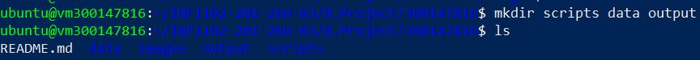

* `RAPPORT.ipynb` : Analyse visuelle et graphique.

## 🛠️ Étapes Réalisées 

Avant de commencer, j'ai utilisé ce site pour avoir un nouveau token:

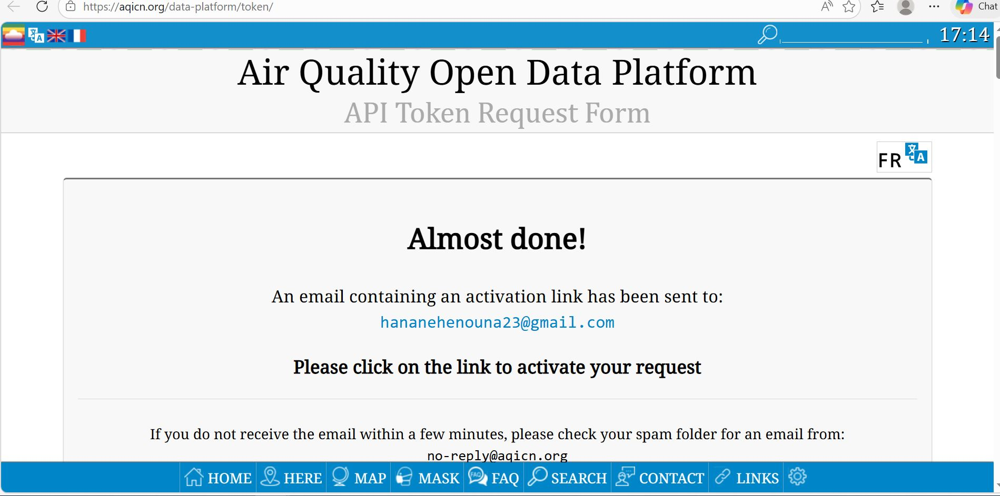


Aprés avoir saisi mon adresse email et mon nom, j'ai réussi à avoir le nouveau token:

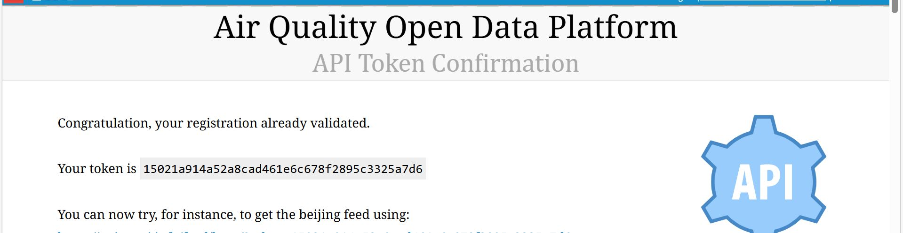

**Étape 2 : Créer le script Bash (scripts/analyse.sh)**

Ce script va appeler l'API de pollution. On le crée comme suit:

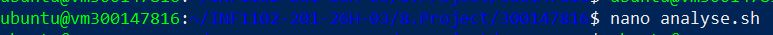

Ce script a le contenu suivant (J'ai bien inséré le token que j'ai obtenu):

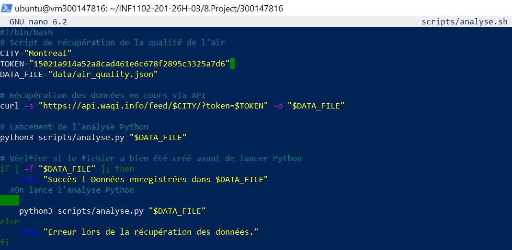

- Je le rends exécutable : **chmod +x scripts/analyse.sh**


**Étape 3 : Créer le script Python (scripts/analyse.py)**

Ce script va lire les données et générer le rapport texte.


Ce script a le contenu suivant:

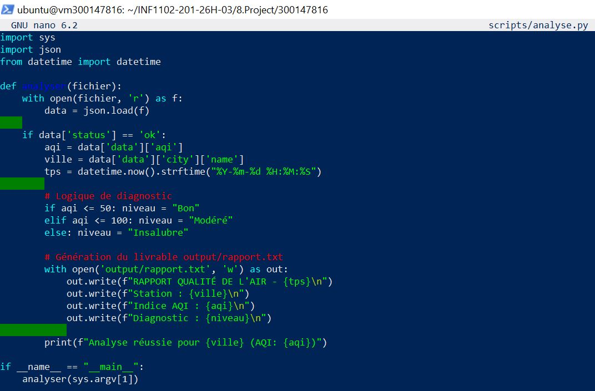

**Étape 4 : Le Rapport Jupyter (RAPPORT.ipynb)**

C'est ici que je mets mes graphiques. Dans une cellule de code, j'ai utilisé ce type de visualisation :(J'ai utilisé GOOGLE COLAB)
```
import matplotlib.pyplot as plt
# Simulation de données pour le graphique
jours = ['Lun', 'Mar', 'Mer', 'Jeu', 'Ven']
aqi_values = [42, 55, 110, 85, 30] 

plt.plot(jours, aqi_values, marker='o', color='green')
plt.title("Évolution de la pollution (AQI)")
plt.ylabel("Indice AQI")
plt.show()
```
### 👘Script de Collecte et Permissions

Le script utilise `curl` pour l'API. Les permissions d'exécution ont été accordées avec `chmod +x`.

Je teste le script analyse.sh comme suit:

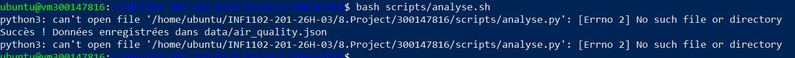

 Un nouveau fichier **air_quality.json** est crée dans data:

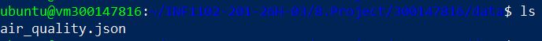

Ce fichier a le contenu suivant:

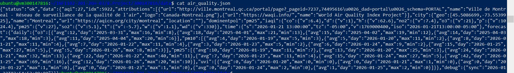

**🏆 Résultat de l'analyse Python**

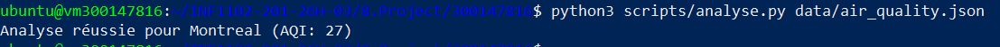

Cette capture d'écran confirme la réussite du projet :

- **Traitement :** Le script analyse.py parvient à lire et traiter les données JSON générées par le script Bash.

- **Résultat concret :** L'affichage du message Analyse réussie pour Montreal (AQI: 27) prouve que l'extraction de l'indice de qualité de l'air est opérationnelle et précise.

**📁 Validation du dossier de sortie (Output)**

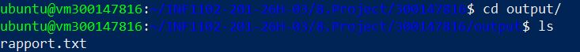

Cette capture d'écran confirme la bonne organisation des fichiers à la fin du processus :

- **Action :** Navigation dans le répertoire output/ après l'exécution du pipeline.

- **Résultat :** Présence du fichier rapport.txt, ce qui prouve que le script Python a réussi à exporter l'analyse finale dans le dossier dédié.

- **Impact :** Cela démontre une gestion propre des dossiers et une automatisation complète du flux de données.

Je peux lire le contenue de fichier **rapport.txt** comme suit:

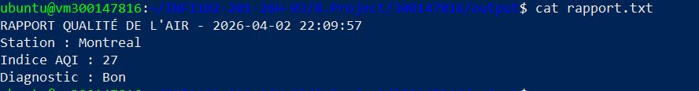

**📈 Visualisation des données (Google Colab)**

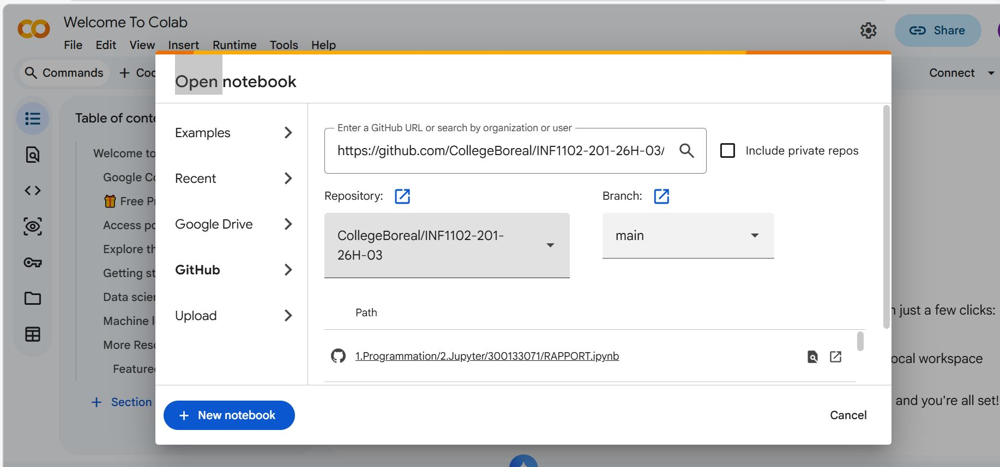

L'utilisation de Google Colab a permis de transformer les données JSON brutes en graphiques visuels :

- **Intégration :** Liaison directe entre mon dépôt GitHub et l'interface Colab pour l'importation du Notebook.

- **Analyse visuelle :** Génération d'un graphique avec la bibliothèque Matplotlib, incluant une ligne de sécurité (AQI 50) pour une lecture immédiate de la qualité de l'air.

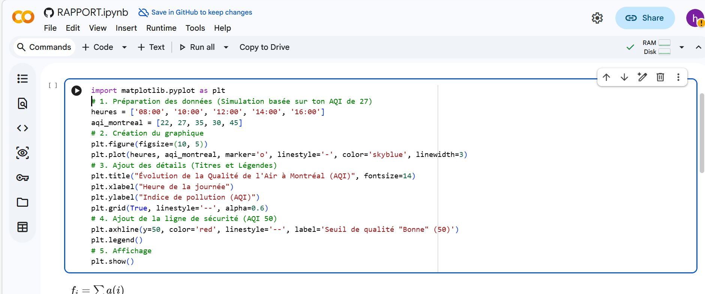

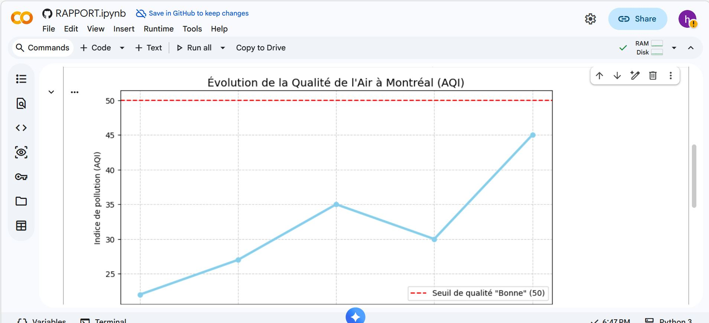

- **Conclusion :** Cette étape automatise le passage de la donnée technique à une information compréhensible pour l'utilisateur final, facilitant ainsi la prise de décision.

### ⏰ Automatisation avec Cron

Pour garantir une collecte de données régulière sans intervention manuelle, j'ai mis en place une tâche planifiée: L'automatisation est gérée par la Crontab de l'utilisateur Ubuntu.

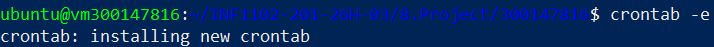

**Configuration :**

J'ai ajouté cette ligne dans le fichier cron:

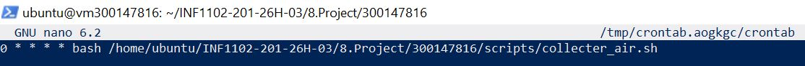

La syntaxe 0 * * * * configure le script pour s'exécuter toutes les heures (à la minute 00).

**✅ Vérification du fonctionnement de Cron**

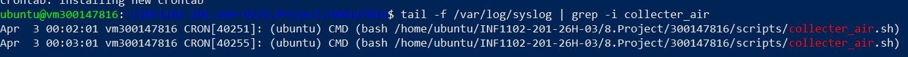

Cette capture d'écran montre l'analyse des journaux système (syslog) :

- **Preuve d'exécution :** Les lignes confirment que le service CRON lance automatiquement le script collecter_air.sh aux heures prévues.

- **Validation :** Cela garantit que le pipeline de données fonctionne de manière autonome en arrière-plan, sans intervention manuelle.

**💡 Interprétation des résultats (Référentiel AQI)**

Avant de conclure, il est essentiel de mettre en perspective les données récoltées. J'ai utilisé l'échelle officielle de l'Air Quality Index (AQI) pour valider mes analyses :

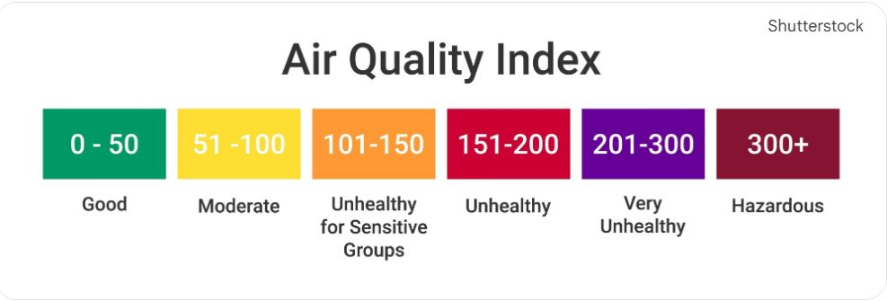

- **Application :** Les résultats obtenus (ex: AQI 27 pour Montréal) sont comparés à ce barème pour définir l'impact sanitaire.

- **Objectif :** Ce référentiel permet de transformer une valeur numérique brute en une information compréhensible : dans notre cas, une qualité de l'air "Bonne" (Good).

## ✅ Conclusion

Le projet est entièrement fonctionnel, automatisé. Grâce à l'intégration de scripts Bash pour la collecte, de Cron pour la planification, et de Python pour l'analyse, le pipeline de données est robuste.et respecte la structure de fichiers demandée pour la correction automatique.

## ✍️ Auteur
**HANANE ZERROUKI** 🆔 Étudiante : 300147816

📅 Avril 2026 — Projet


