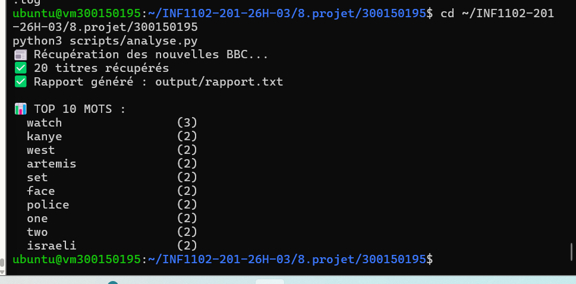
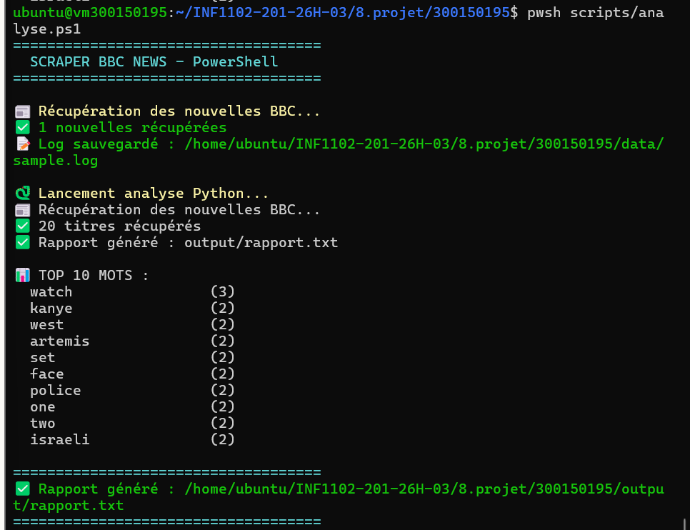
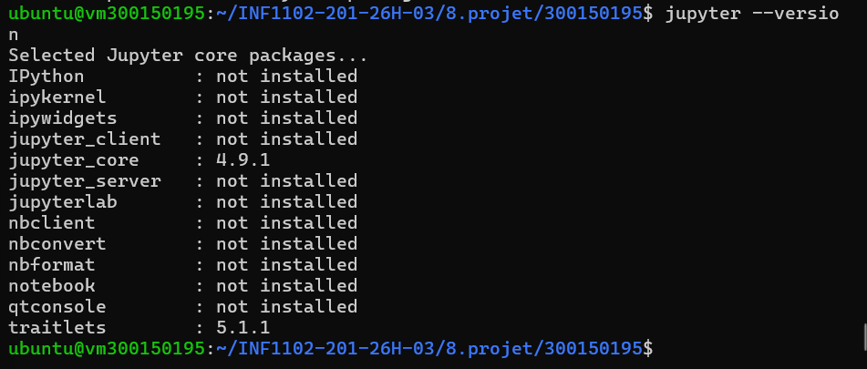
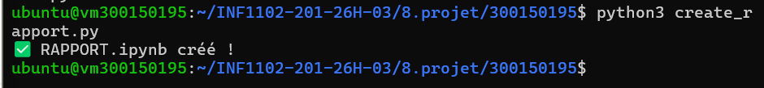

# 📰 Scraper BBC News

> **Amel Zourane** | **300150195**  
> **INF1102-201-26H-03** | **Collège Boréal** | **2026**

---

## 🎯 Objectif

Ce projet automatise la récupération et l'analyse des nouvelles **BBC News** via flux RSS.
Il extrait les titres, identifie les mots les plus fréquents et génère un rapport complet.

- ✅ Récupérer 20 titres BBC News via RSS en temps réel
- ✅ Analyser les mots fréquents avec des expressions régulières
- ✅ Générer un rapport texte automatique
- ✅ Automatiser l'exécution avec PowerShell + Python
- ✅ Documenter les résultats dans un Jupyter Notebook

---

## 🖥️ Environnement

| Élément | Détail |
|--------|--------|
| 💻 Machine | vm300150195 |
| 🌐 IP | 10.7.237.214 |
| 🐧 OS | Ubuntu 22.04 LTS |
| 🐍 Python | 3.x |
| ⚡ PowerShell | 7.6.0 |

---

## 📂 Structure du projet

| Fichier | Description |
|---------|-------------|
| `scripts/analyse.ps1` | Script PowerShell principal |
| `scripts/analyse.py` | Script Python — scraping + analyse |
| `data/sample.log` | Fichier de logs |
| `output/rapport.txt` | Rapport généré automatiquement |
| `RAPPORT.ipynb` | Rapport Jupyter Notebook |
| `README.md` | Ce fichier |

---

## ▶️ Exécution

### Script Python
```bash
python3 scripts/analyse.py
```

### Script PowerShell
```bash
pwsh scripts/analyse.ps1
```

---

## 📸 Script Python — Résultats



---

## 📸 Script PowerShell — Résultats



---

## 📸 Jupyter — Version installée



---

## 📸 Création du RAPPORT.ipynb



---

## 📊 Exemple de rapport généré

| Mot | Fréquence |
|-----|-----------|
| watch | 3 |
| kanye | 2 |
| west | 2 |
| artemis | 2 |
| police | 2 |

---

## ✅ Compétences couvertes

| Compétence | Détail |
|-----------|--------|
| 🐍 Python | Scraping RSS, Regex, Counter |
| ⚡ PowerShell | Invoke-RestMethod, Out-File |
| 🔍 Regex | Extraction et analyse de texte |
| 📓 Jupyter | Documentation et visualisation |
| 🐧 Linux | Administration Ubuntu 22.04 |
