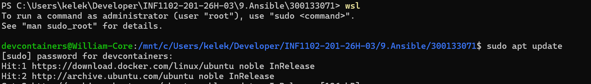
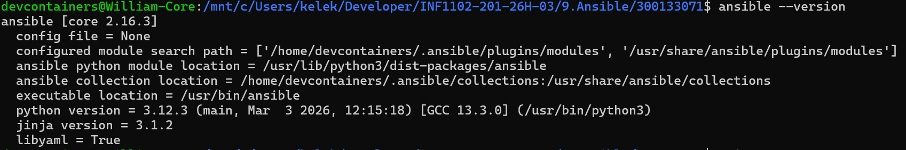
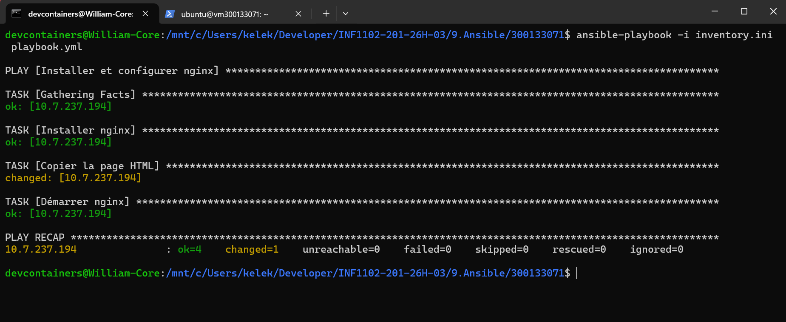
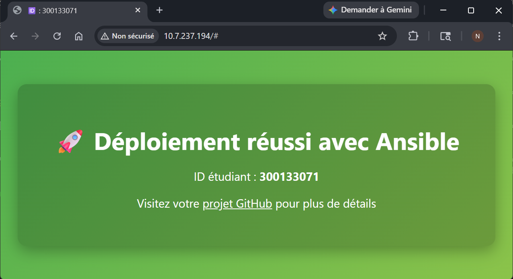

# 🧪 TP : Déploiement automatisé Nginx

## 🎯 Objectif
Ce TP a pour but de créer un système automatisé qui :

- Installe **Nginx** sur un serveur distant
- Déploie une **page web personnalisée**
- Active le **service Nginx**

L’objectif est de se familiariser avec **Ansible** et le concept d’**Infrastructure as Code (IaC)**.

---

## 📋 Travail demandé

### 1️⃣ Créer la structure des fichiers
```bash
<300133071>/
├──files
    ├── index.html
├── images
├── inventory.ini
├── playbook.yml
└── files/index.html
```
---
le package ansible n’existe pas (ou plus) directement sur Chocolatey. Et même quand il existait, Ansible n’est pas conçu pour tourner nativement sur Windows.

🔹Solution utilisé — WSL

Installe WSL :

```powershell
wsl --install
```

Redémarre ton PC

Installe Ansible :

```powershell
wsl
```


```bash
sudo apt update
sudo apt install ansible-core -y
```


execution du playbook



resultat



commandes utile

```powershell
wsl -u root       # lancer WSL en mode root
wsl -l -v         # lister les distributions installées
```
```text
Idempotence signifie que tu peux exécuter la même tâche plusieurs fois sans changer le résultat si l’état désiré est déjà atteint.

present	Assure que la ressource existe (package installé, fichier présent). Ne démarre pas un service.
started	Pour un service, assure qu’il est en cours d’exécution. Ne l’installe pas si le package n’existe pas (mais souvent combiné avec enabled pour démarrage automatique).

become: yes permet d’exécuter la tâche avec les privilèges root (ou un autre utilisateur via become_user).
```

## ✅ Conclusion et apprentissages

### Conclusion
Le TP montre qu’**Ansible permet de déployer et configurer des services de manière automatisée et fiable**. Grâce à l’approche déclarative, l’état des serveurs peut être géré facilement, reproductible et sécurisé.

### Choses apprises
- Comprendre le fonctionnement d’**Ansible et son idempotence**
- Installer et utiliser Ansible sur **WSL ou Linux**
- Créer un **playbook pour installer Nginx**, déployer une page web et gérer les services
- Utiliser des **handlers** pour redémarrer automatiquement les services
- Gérer la **structure des fichiers** et l’**inventory**
- Notions importantes : `become: yes`, `present`, `started`, idempotence
