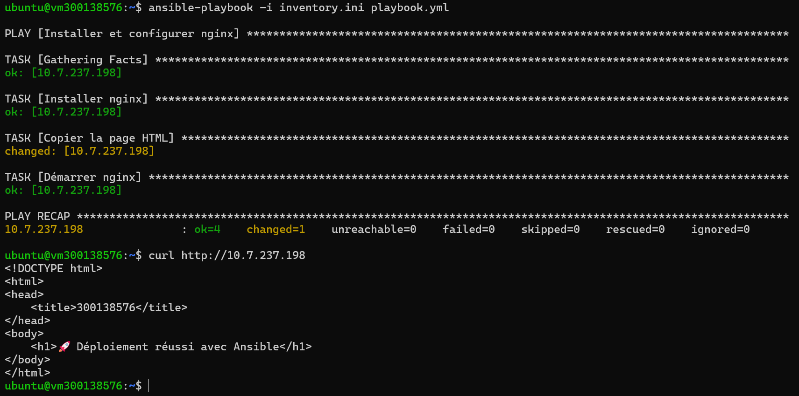

# 🚀 Lab Ansible – Déploiement automatisé de Nginx

## 🎯 Objectif

Ce laboratoire a pour objectif d’utiliser **Ansible** afin d’automatiser la configuration d’un serveur Linux.

Les tâches réalisées :

* Installation de Nginx
* Déploiement d’une page HTML personnalisée
* Démarrage et activation du service
* Vérification du déploiement

---

## 🗂️ Structure du projet

```bash
9.Ansible/
└── 300138576/
    ├── inventory.ini
    ├── playbook.yml
    ├── README.md
    ├── files/
    │   └── index.html
    └── images/
        └── 1.png
```

---

## ⚙️ Configuration

### 📌 Inventory (inventory.ini)

```ini
[web]
10.7.237.198 ansible_user=ubuntu ansible_ssh_private_key_file=~/.ssh/ma_cle.pem
```

---

### 📌 Playbook (playbook.yml)

```yaml
- name: Installer et configurer nginx
  hosts: web
  become: yes

  tasks:

    - name: Installer nginx
      apt:
        name: nginx
        state: present
        update_cache: yes

    - name: Copier la page HTML
      copy:
        src: files/index.html
        dest: /var/www/html/index.nginx-debian.html

    - name: Démarrer nginx
      service:
        name: nginx
        state: started
        enabled: yes
```

---

### 📌 Page HTML déployée

```html
<!DOCTYPE html>
<html>
<head>
    <title>300138576</title>
</head>
<body>
    <h1>🚀 Déploiement réussi avec Ansible</h1>
</body>
</html>
```

---

## ▶️ Exécution

Commande utilisée :

```bash
ansible-playbook -i inventory.ini playbook.yml
```

---

## 📊 Résultat

```text
ok=4
changed=1
failed=0
```

✔ Installation réussie
✔ Configuration appliquée
✔ Aucun échec

---

## 🌐 Vérification

Commande :

```bash
curl http://10.7.237.198
```

Résultat :

```html
<h1>🚀 Déploiement réussi avec Ansible</h1>
```

---

## 🖼️ Preuve d’exécution



---

## 🧠 Concepts importants

### 🔹 Idempotence

Ansible applique uniquement les changements nécessaires.
Si le système est déjà configuré → aucune modification (`changed=0`).

---

### 🔹 become: yes

Permet d’exécuter les tâches avec les privilèges administrateur (sudo).

---

### 🔹 Modules utilisés

* `apt` → installation de paquets
* `copy` → transfert de fichiers
* `service` → gestion des services

---

## ✅ Conclusion

Ce laboratoire démontre l’efficacité d’**Ansible** pour :

* automatiser la configuration serveur
* garantir des déploiements fiables
* éviter les erreurs manuelles

C’est une approche moderne basée sur **Infrastructure as Code (IaC)**.

---
