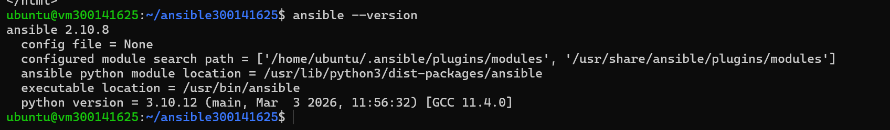
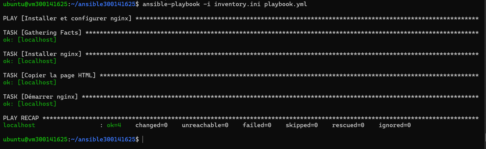
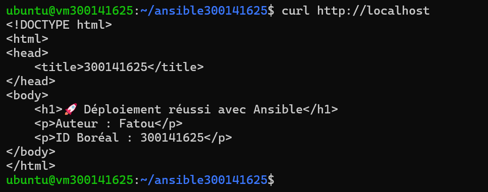
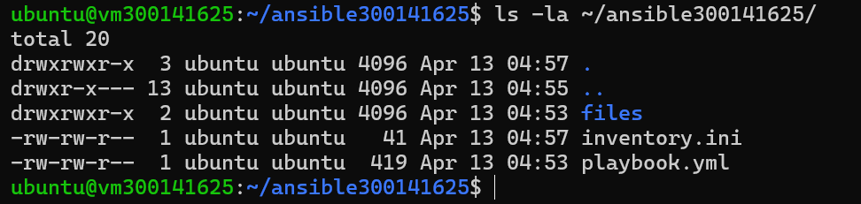

# Lab 9 – Déploiement automatisé Nginx avec Ansible

## 🎯 Objectif
Déployer automatiquement Nginx avec Ansible sur une VM Ubuntu.

## 📂 Structure
300141625/
├── inventory.ini
├── playbook.yml
└── files/
└── index.html
## 📸 Étapes effectuées sur Ubuntu

### 1. Version Ansible


### 2. Exécution du playbook


### 3. Vérification curl


### 4. Structure des fichiers


## ▶️ Exécution
```bash
ansible-playbook -i inventory.ini playbook.yml
```

## 🧪 Vérification
```bash
curl http://localhost
```

## ✅ Conclusion
Ansible permet de déployer automatiquement Nginx de façon déclarative et idempotente.

## 👤 Auteur
- Nom : Fatou
- ID Boréal : 300141625
