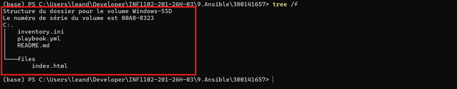
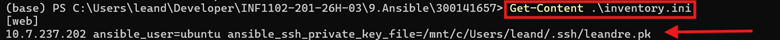
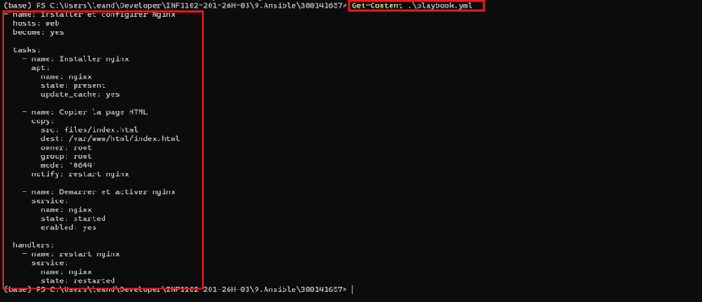
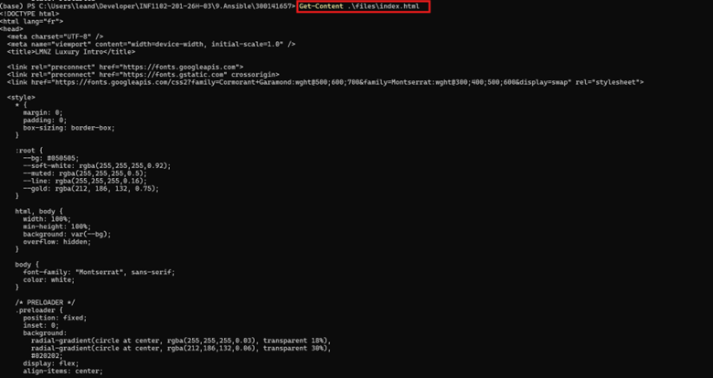
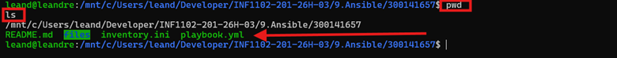
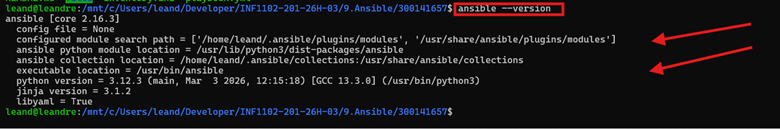
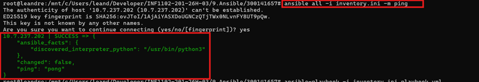
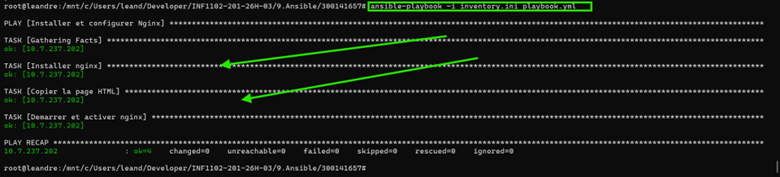

# TP : Déploiement automatisé Nginx avec Ansible

## Informations

**Nom :** Léandre Manizan  
**Numéro étudiant :** 300141657  
**Cours :** INF1102-201-26H-03  

---

## Objectif

Ce TP consiste à automatiser le déploiement d’un site web avec **Ansible**.

Le projet permet de :

- installer **nginx**
- copier une page web HTML sur le serveur
- démarrer et activer le service
- vérifier le résultat dans le navigateur

---

## Structure du projet

```text
300141657/
├── inventory.ini
├── playbook.yml
├── README.md
├── files/
│   └── index.html
└── images/
    ├── Image43.png
    ├── Image44.png
    ├── Image45.png
    ├── Image46.png
    ├── Image47.png
    ├── Image48.png
    ├── Image49.png
    ├── Image50.png
    ├── Image51.png
    └── Image52.png
```

---

## 1. Vérification de la structure du dossier

### Commande

```powershell
tree /f
```

### Capture



---

## 2. Vérification du fichier `inventory.ini`

### Commande

```powershell
Get-Content .\inventory.ini
```

### Capture



---

## 3. Vérification du fichier `playbook.yml`

### Commande

```powershell
Get-Content .\playbook.yml
```

### Capture



---

## 4. Vérification du fichier `files/index.html`

### Commande

```powershell
Get-Content .\files\index.html
```

### Capture



---

## 5. Ouverture de Ubuntu dans WSL

### Commande

```powershell
wsl -d Ubuntu
```

### Capture


---

## 6. Vérification du dossier du projet dans Ubuntu

### Commandes

```bash
pwd
ls
```

### Capture



---

## 7. Vérification de la version d’Ansible

### Commande

```bash
ansible --version
```

### Capture



---

## 8. Test de connexion avec la machine virtuelle

### Commande

```bash
ansible all -i inventory.ini -m ping
```

### Capture



---

## 9. Exécution du playbook Ansible

### Commande

```bash
ansible-playbook -i inventory.ini playbook.yml
```

### Capture



---

## 10. Vérification finale dans le navigateur

### Adresse

```text
http://10.7.237.202
```

### Capture


---

## Explication des éléments importants

## Pourquoi Ansible est idempotent ?

Ansible est idempotent parce qu’il applique un **état désiré**.  
Si une tâche a déjà été exécutée et que l’état attendu est déjà atteint, Ansible ne refait pas inutilement la même action.

Par exemple :

- si nginx est déjà installé, il ne le réinstalle pas
- si le service est déjà démarré, il ne le relance pas inutilement
- si le fichier HTML est déjà identique, il ne le recopie pas

---

## Différence entre `present` et `started`

### `present`

Ce mot-clé signifie qu’un élément doit **exister**.

Exemple :

```yaml
state: present
```

Cela veut dire que le paquet `nginx` doit être installé.

### `started`

Ce mot-clé signifie qu’un service doit être **démarré**.

Exemple :

```yaml
state: started
```

Cela veut dire que le service `nginx` doit être en cours d’exécution.

---

## Pourquoi utiliser `become: yes` ?

`become: yes` permet d’exécuter les tâches avec les privilèges administrateur.

Cela est nécessaire pour :

- installer des paquets
- copier des fichiers dans `/var/www/html`
- gérer le service `nginx`

Sans cela, certaines tâches ne pourraient pas être exécutées correctement.

---

## Conclusion

Ce TP m’a permis de mettre en pratique le déploiement automatisé avec **Ansible**.

J’ai pu :

- utiliser un fichier d’inventaire
- écrire un playbook YAML
- déployer automatiquement une page web
- démarrer et activer nginx
- vérifier le bon fonctionnement du site dans le navigateur

Ce travail montre que **Ansible** est un outil très utile pour automatiser la configuration et le déploiement de services sur un serveur Linux.
