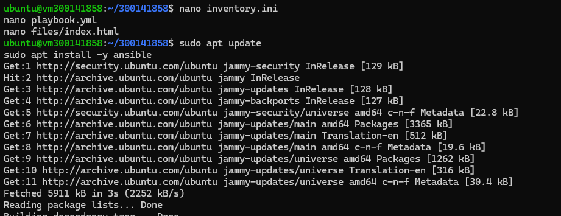
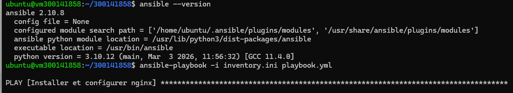
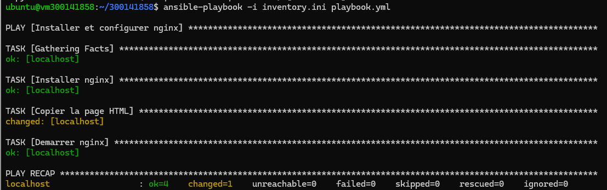
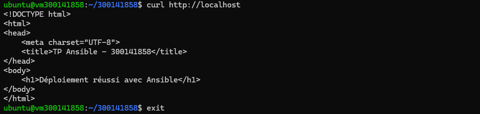

# 🚀 TP Ansible - Déploiement automatisé Nginx

## 👤 Étudiant
**Nom :** Abdou Karim NIANG  
**Identifiant Boréal :** 300141858  

---

## 🎯 Objectif

Automatiser la configuration d’un serveur web avec Ansible.

---

## 📁 Structure

```
300141858/
├── README.md
├── inventory.ini
├── playbook.yml
├── files/
│   └── index.html
└── images/
    ├── 1-installation.png
    ├── 2-ansible-run.png
    ├── 3-play-recap.png
    └── 4-curl-result.png
```

---

## 🔧 Installation



---

## ▶️ Exécution

```
ansible-playbook -i inventory.ini playbook.yml
```



---

## 📊 Résultat



---

## 🌐 Vérification

```
curl http://localhost
```

