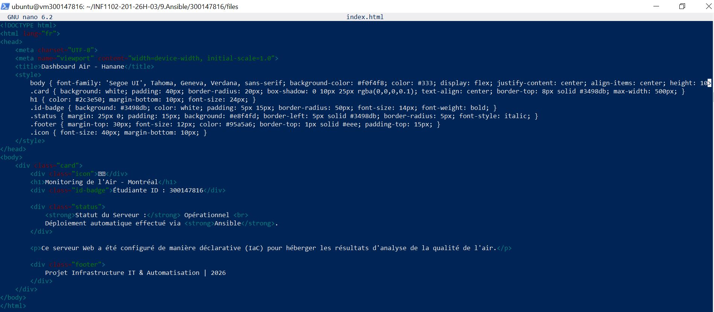

**🚀 TP Ansible - Déploiement automatisé: Qualité de l'Air Montréal**

**👤 Étudiante:**

⁕**Nom :** Hanane Zerrouki

⁕**Identifiant Boréal :** 300147816

⁕**Cours:** Programmation Systèmes:

**🎯 Objectif**

Automatiser la configuration et le déploiement d'un serveur web Nginx pour diffuser les données de qualité de l'air de Montréal via Ansible.

**📁 Structure du Projet**

300147816/

├── README.md             # Documentation du projet

├── inventory.ini         # Inventaire des serveurs cibles

├── playbook.yml          # Playbook Ansible

├── files/

│   └── index.html        # Page HTML personnalisée

└── images/               # Captures d'écran
    
**📄 Contenu des fichiers**

## 1. Fichier d'inventaire : inventory.ini

**Explication:**

- **[web]  :**                   Groupe d'hôtes nommé "web"

- **10.7.237.213   :**           Adresse IP du serveur cible

- **ansible_user=ubuntu:**       Utilisateur pour l'exécution

- **ansible_connection=local:**    Exécution locale (pas de SSH car Ansible est sur le serveur)

**💡 Note :** 

**ansible_connection=local** est utilisé car Ansible est installé **DIRECTEMENT sur le serveur cible**. Pas besoin de clé SSH.

## 2. Playbook Ansible : playbook.yml

**Explication:**

- **apt:**  permet d'installer nginx, voici la commande équivalente: **sudo apt install nginx -y**

- **copy:** permet de copier la page HTML, voici la commande équivalente: **sudo cp files/index.html /var/www/html/**	

- **service:** permet de démarrer nginx, voici la commande équivalente: **sudo systemctl enable --now nginx**

## 3. Page HTML personnalisée : files/index.html

**Affichage attendu :**

**🌍 Titre :** "Monitoring de l'Air - Montréal"

**🆔 ID étudiant :** 300147816

**✅ Statu:** Opérationnel(déploiement Ansible)

**📄 Description :** Infrastructure as Code (IaC)

**🚀 Exécution du Playbook**

**Étape 1 : Vérifier la connexion**

**Étape 2 : Exécuter le playbook**

**🌐 Vérification du déploiement**

## Depuis le terminal :

## Depuis un navigateur :

On ouvre l'URL : **http://10.7.237.213**

**🎓 Concepts clés abordés**

- **✅ Infrastructure as Code (IaC) :** La configuration est décrite dans des fichiers

- **✅ Ansible:** Outil d'automatisation sans agent

- **✅ Playbook :** Séquence de tâches en YAML

- **✅ Idempotence:** Exécuter plusieurs fois sans effet de bord

- **✅SSH vs local:**  Comprendre quand utiliser chaque méthode

**🔓Conclusion**

Ce travail pratique a démontré qu'Ansible est un outil puissant et efficace pour automatiser le déploiement et la configuration de services informatiques, en l'occurrence un serveur web Nginx

## ✍️ Auteur
**HANANE ZERROUKI** 🆔 Étudiante : 300147816

📅 Avril 2026 — Laboratoire Ansible

