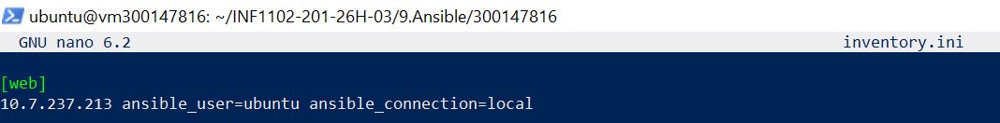
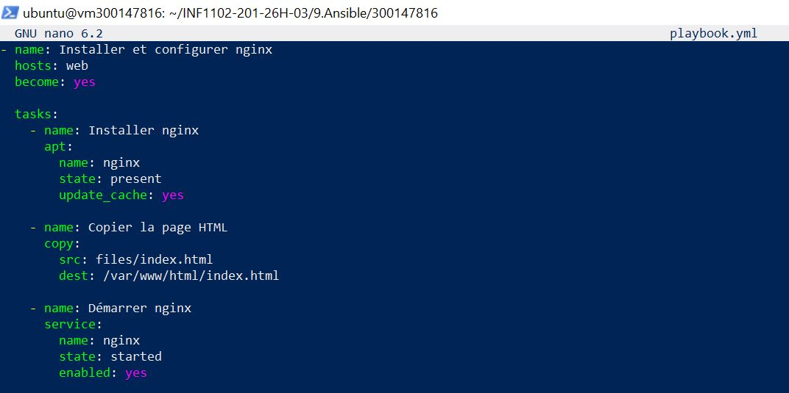
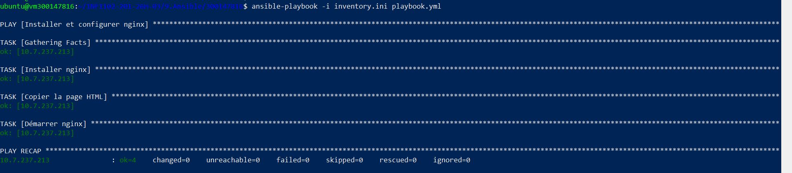
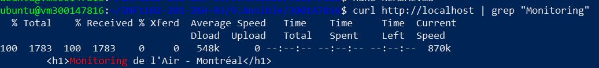
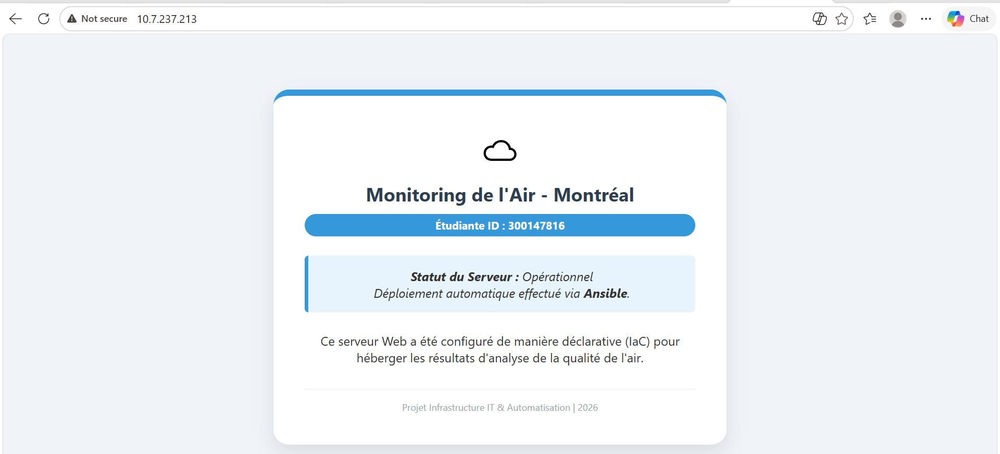

**🚀 TP Ansible - Déploiement automatisé: Qualité de l'Air Montréal**

**👤 Étudiante:**

⁕**Nom :** Hanane Zerrouki

⁕**Identifiant Boréal :** 300147816

⁕**Cours:** Programmation Systèmes:

**🎯 Objectif**

Automatiser la configuration et le déploiement d'un serveur web Nginx pour diffuser les données de qualité de l'air de Montréal via Ansible.

**📁 Structure du Projet**

300147816/

├── README.md             # Documentation du projet

├── inventory.ini         # Inventaire des serveurs cibles

├── playbook.yml          # Playbook Ansible

├── files/

│   └── index.html        # Page HTML personnalisée

└── images/               # Captures d'écran
    
**📄 Contenu des fichiers**

## 1. Fichier d'inventaire : inventory.ini



**Explication:**

- **[web]  :**                   Groupe d'hôtes nommé "web"

- **10.7.237.213   :**           Adresse IP du serveur cible

- **ansible_user=ubuntu:**       Utilisateur pour l'exécution

- **ansible_connection=local:**    Exécution locale (pas de SSH car Ansible est sur le serveur)

**💡 Note :** 

**ansible_connection=local** est utilisé car Ansible est installé **DIRECTEMENT sur le serveur cible**. Pas besoin de clé SSH.

## 2. Playbook Ansible : playbook.yml



**Explication:**

- **apt:**  permet d'installer nginx, voici la commande équivalente: **sudo apt install nginx -y**

- **copy:** permet de copier la page HTML, voici la commande équivalente: **sudo cp files/index.html /var/www/html/**	

- **service:** permet de démarrer nginx, voici la commande équivalente: **sudo systemctl enable --now nginx**

#3. Page HTML personnalisée : files/index.html
```
<!DOCTYPE html>
<html lang="fr">
<head>
    <meta charset="UTF-8">
    <meta name="viewport" content="width=device-width, initial-scale=1.0">
    <title>Dashboard Air - Hanane</title>
    <style>
        body { 
            font-family: 'Segoe UI', Tahoma, Geneva, Verdana, sans-serif; 
            background-color: #f0f4f8; 
            color: #333; 
            display: flex; 
            justify-content: center; 
            align-items: center; 
            min-height: 100vh;
            margin: 0;
        }
        .card { 
            background: white; 
            padding: 40px; 
            border-radius: 20px; 
            box-shadow: 0 10px 25px rgba(0,0,0,0.1); 
            text-align: center; 
            border-top: 8px solid #3498db; 
            max-width: 500px;
            margin: 20px;
        }
        h1 { 
            color: #2c3e50; 
            margin-bottom: 10px; 
            font-size: 24px; 
        }
        .id-badge { 
            background: #3498db; 
            color: white; 
            padding: 5px 15px; 
            border-radius: 5px; 
            font-size: 14px; 
            font-weight: bold; 
            display: inline-block;
        }
        .status { 
            margin: 25px 0; 
            padding: 15px; 
            background: #e8f4f8; 
            border-left: 5px solid #3498db; 
            border-radius: 5px; 
        }
        .footer { 
            margin-top: 30px; 
            font-size: 12px; 
            color: #95a5a6; 
            border-top: 1px solid #eee; 
            padding-top: 15px; 
        }
    </style>
</head>
<body>
    <div class="card">
        <div class="icon">🌍</div>
        <h1>Monitoring de l'Air - Montréal</h1>
        <div class="id-badge">Étudiante ID : 300147816</div>

        <div class="status">
            <strong>Statut du Serveur :</strong> Opérationnel <br>
            Déploiement automatique effectué via <strong>Ansible</strong>.
        </div>

        <p>Ce serveur Web a été configuré de manière déclarative (IaC) pour héberger les résultats d'analyse de la qualité de l'air.</p>

        <div class="footer">
            Projet Infrastructure IT & Automatisation | 2026
        </div>
    </div>
</body>
</html>
```
**Affichage attendu :**

**🌍 Titre :** "Monitoring de l'Air - Montréal"

**🆔 ID étudiant :** 300147816

**✅ Statu:** Opérationnel(déploiement Ansible)

**📄 Description :** Infrastructure as Code (IaC)


**🚀 Exécution du Playbook**

**Étape 1 : Vérifier la connexion**


**Étape 2 : Exécuter le playbook**



**🌐 Vérification du déploiement**

## Depuis le terminal :



## Depuis un navigateur :

On ouvre l'URL : **http://10.7.237.213**



**🎓 Concepts clés abordés**

- **✅ Infrastructure as Code (IaC) :** La configuration est décrite dans des fichiers

- **✅ Ansible:** Outil d'automatisation sans agent

- **✅ Playbook :** Séquence de tâches en YAML

- **✅ Idempotence:** Exécuter plusieurs fois sans effet de bord

- **✅ SSH vs Loca **: Comprendre quand utiliser chaque méthode

**🔓Conclusion**

Ce travail pratique a démontré qu'Ansible est un outil puissant et efficace pour automatiser le déploiement et la configuration de services informatiques, en l'occurrence un serveur web Nginx

## ✍️ Auteur
**HANANE ZERROUKI** 🆔 Étudiante : 300147816

📅 Avril 2026 — Laboratoire Ansible


