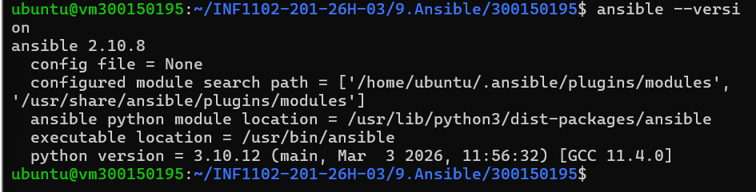
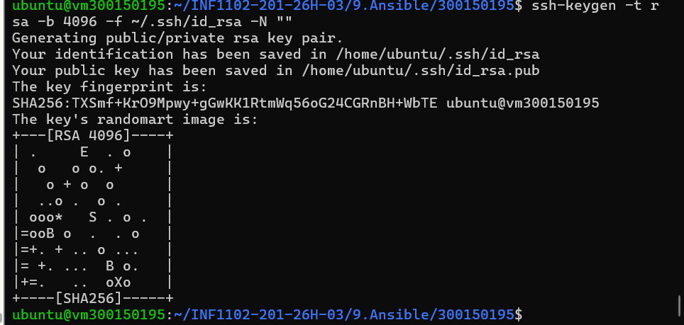
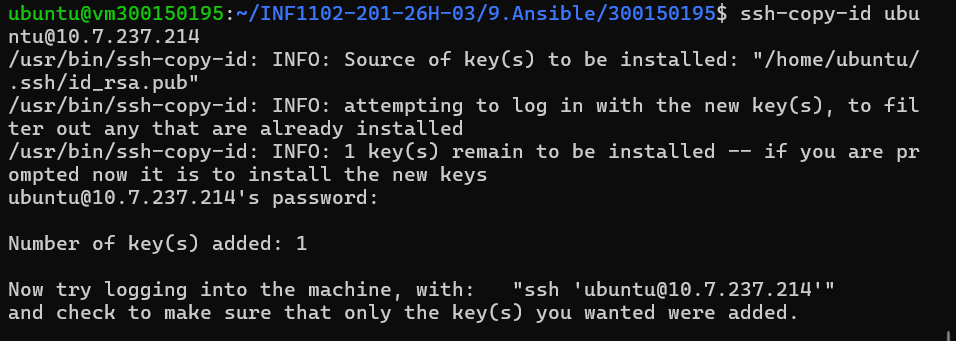
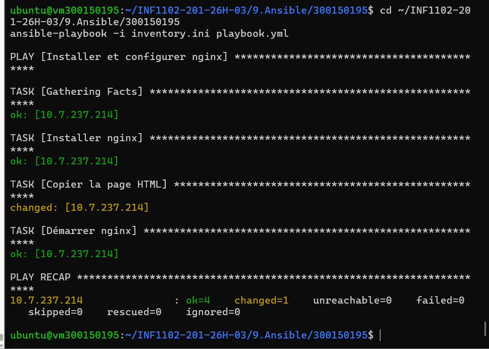

# 🤖 Déploiement Nginx avec Ansible

> **Amel Zourane** | **300150195**
> **INF1102-201-26H-03** | **Collège Boréal** | **2026**

---

## 🎯 Objectif

Ce TP démontre l'utilisation d'**Ansible** comme outil d'**Infrastructure as Code (IaC)**
pour automatiser le déploiement de Nginx sur une VM Ubuntu 22.04.

- ✅ Installer Nginx automatiquement
- ✅ Déployer une page HTML personnalisée
- ✅ Démarrer et activer le service Nginx
- ✅ Utiliser un playbook YAML déclaratif
- ✅ Connexion SSH sans mot de passe

---

## 🖥️ Environnement

| Élément | Détail |
|--------|--------|
| 💻 Machine | vm300150195 |
| 🌐 IP | 10.7.237.214 |
| 🐧 OS | Ubuntu 22.04 LTS |
| 🤖 Ansible | 2.10.8 |

---

## 📂 Structure du projet

| Fichier | Description |
|---------|-------------|
| `inventory.ini` | Fichier d'inventaire des hôtes |
| `playbook.yml` | Playbook Ansible principal |
| `files/index.html` | Page HTML déployée par Ansible |

---

## 📄 Inventory

```ini
[web]
10.7.237.214 ansible_user=ubuntu ansible_ssh_private_key_file=~/.ssh/id_rsa
```

---

## 📜 Playbook

```yaml
- name: Installer et configurer nginx
  hosts: web
  become: yes
  tasks:
    - name: Installer nginx
      apt:
        name: nginx
        state: present
    - name: Copier la page HTML
      copy:
        src: files/index.html
        dest: /var/www/html/index.nginx-debian.html
    - name: Démarrer nginx
      service:
        name: nginx
        state: started
```

---

## ▶️ Exécution

```bash
ansible-playbook -i inventory.ini playbook.yml
```

---

## 📸 Version Ansible installée



---

## 📸 Génération clé SSH



---

## 📸 Copie clé SSH



---

## 📸 Exécution du Playbook



---

## 📸 Résultat — Site déployé


---

## 🧠 Concepts clés

| Concept | Explication |
|---------|-------------|
| **IaC** | On décrit l'infrastructure avec du code |
| **Déclaratif** | On décrit ce qu'on veut, pas comment |
| **Idempotent** | Même résultat si on relance plusieurs fois |
| **Inventory** | Liste des machines cibles |
| **Playbook** | Script YAML des tâches à exécuter |
| **become: yes** | Exécution avec droits sudo |

---

## 🔍 Vérification

```bash
curl http://10.7.237.214
```

---

## ✅ Compétences couvertes

| Compétence | Détail |
|-----------|--------|
| 🤖 Ansible | Playbook YAML, inventory |
| 🔑 SSH | Clé RSA, authentification sans mot de passe |
| 🌐 Nginx | Déploiement automatisé |
| 🐧 Linux | Administration Ubuntu 22.04 |
| 📋 YAML | Syntaxe déclarative |
