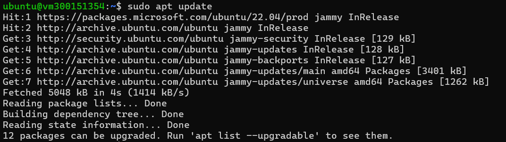
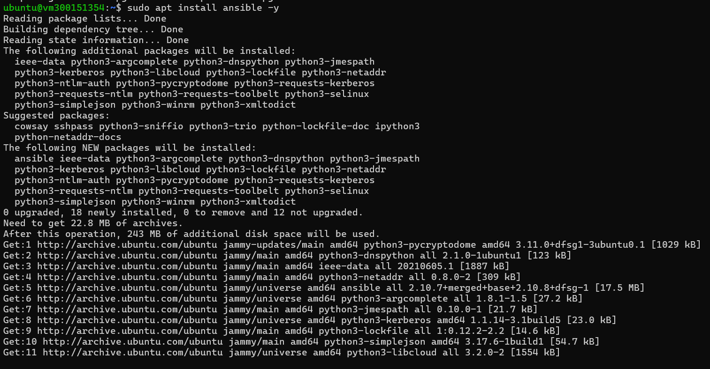
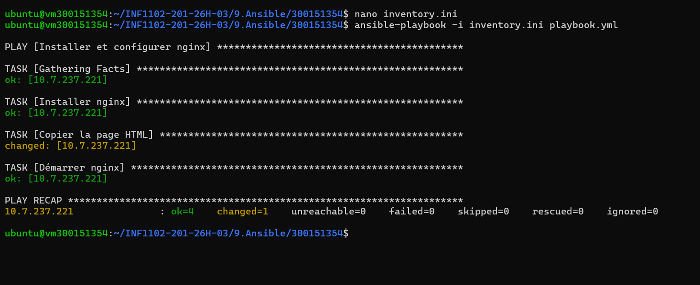
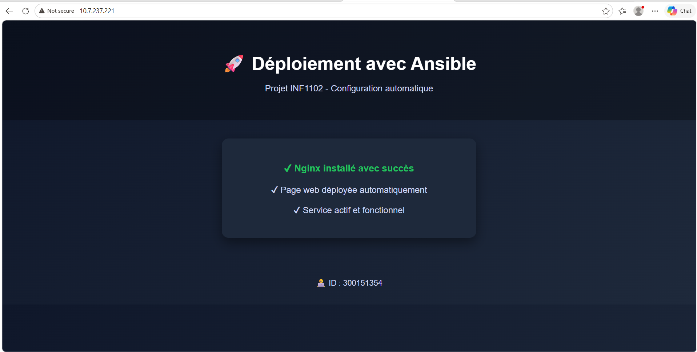

# 🚀 TP Ansible — Déploiement automatique de Nginx
 
> **Cours :** INF1102-201-26H-03  
> **Étudiant :** 300151354  
> **Sujet :** Infrastructure as Code — Automatisation avec Ansible
 
---
 
## 📋 Description
 
Ce projet consiste à automatiser le déploiement d'un serveur web **Nginx** sur une machine virtuelle Ubuntu à l'aide d'**Ansible**. Le playbook installe Nginx, déploie une page HTML personnalisée et démarre le service automatiquement — sans aucune intervention manuelle sur la VM cible.
 
---
 
## 🗂️ Structure du projet
 
```
300151354/
├── inventory.ini        # Liste des hôtes cibles
├── playbook.yml         # Playbook Ansible principal
├── files/
│   └── index.html       # Page web déployée sur le serveur
└── README.md
```
 
---
 
## ⚙️ Prérequis
 
- Ubuntu 22.04 (machine de contrôle)
- Ansible installé (`sudo apt install ansible -y`)
- Accès SSH à la VM cible via clé publique
- VM cible accessible sur le réseau
---
 
## 🛠️ Installation & Utilisation
 
### 1. Mettre à jour les paquets et installer Ansible
 
```bash
sudo apt update
sudo apt install ansible -y
```
 
### 2. Configurer l'inventaire
 
Modifier `inventory.ini` avec l'IP de votre VM :
 
```ini
[web]
10.7.237.221 ansible_user=ubuntu ansible_ssh_private_key_file=~/.ssh/id_ed25519
```
 
### 3. Lancer le playbook
 
```bash
ansible-playbook -i inventory.ini playbook.yml
```
 
### 4. Vérifier le déploiement
 
```bash
curl http://10.7.237.221
```
 
Ou ouvrir dans un navigateur : `http://10.7.237.221`
 
---
 
## 📄 Contenu du playbook
 
```yaml
- name: Installer et configurer nginx
  hosts: web
  become: yes
 
  tasks:
    - name: Installer nginx
      apt:
        name: nginx
        state: present
        update_cache: yes
 
    - name: Copier la page HTML
      copy:
        src: files/index.html
        dest: /var/www/html/index.nginx-debian.html
 
    - name: Démarrer nginx
      service:
        name: nginx
        state: started
        enabled: yes
```
 
---
 
## 📸 Captures d'écran
 
### 1. Mise à jour du système

 
### 2. Installation d'Ansible

 
### 3. Exécution du playbook — Succès

 
> `ok=4   changed=1   unreachable=0   failed=0` ✅
 
### 4. Page web déployée

 
---
 
## ✅ Résultat
 
| Tâche | Statut |
|---|---|
| Connexion SSH à la VM | ✅ |
| Installation de Nginx | ✅ |
| Déploiement de la page HTML | ✅ |
| Démarrage du service Nginx | ✅ |
| Page accessible dans le navigateur | ✅ |
 
---
 
## 🧠 Concepts clés
 
**Pourquoi Ansible est idempotent ?**  
Ansible applique un état final désiré. Si l'état est déjà atteint (ex: Nginx déjà installé), il ne refait pas l'action. On peut relancer le playbook plusieurs fois sans effets indésirables.
 
**Différence entre `present` et `started` :**
- `state: present` → le paquet doit être **installé**
- `state: started` → le service doit être **en cours d'exécution**
**Pourquoi `become: yes` ?**  
Pour exécuter les tâches avec les droits **sudo** (administrateur), nécessaires pour installer des paquets et gérer des services système.
 
---
 
## 👤 Auteur
 
**Étudiant ID :** 300151354  
**Cours :** INF1102 — Administration système
